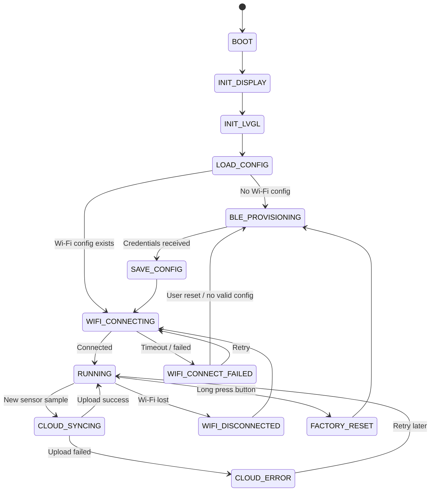

# ESP32-S3 Smart Room Cloud Gateway — Roadmap & Tracking

**Project name:** ESP32-S3 Smart Room Cloud Gateway  
**Target board:** ESP32-S3  
**Main stack:** ESP-IDF, FreeRTOS, Wi-Fi, BLE Provisioning, LVGL, Firebase Realtime Database  
**Created date:** 2026-06-30  
**Owner:** Trần Long Hải  

---

## 1. Project Goal

Build a practical ESP32-S3 IoT device that can:

1. Use **BLE** to configure Wi-Fi credentials.
2. Connect to the internet through **Wi-Fi Station mode**.
3. Display local device status and sensor data on an **LCD using LVGL**.
4. Read sensor data such as temperature/humidity.
5. Upload latest and historical data to a cloud service, initially **Firebase Realtime Database**.
6. Store configuration locally using **NVS**.
7. Support factory reset through a physical button.
8. Be structured as a maintainable embedded project with components, state machine, event flow, logs, and documentation.

This project follows a **project-driven learning approach**: learn ESP-IDF topics just-in-time while building real features.

---

## 2. Final Product Vision

The final device should behave like a small smart room gateway:

```text
First boot / no Wi-Fi config
    ↓
Start BLE provisioning
    ↓
Phone sends Wi-Fi SSID/password
    ↓
ESP32 stores credentials in NVS
    ↓
ESP32 connects to Wi-Fi
    ↓
LCD shows device status, IP, sensor values, cloud sync status
    ↓
ESP32 periodically uploads sensor data to Firebase
```

---

## 3. Core Features

| Feature | Priority | Status | Notes |
|---|---:|---|---|
| LCD bring-up | P0 | Done | ST7735 / SPI hardware-accepted |
| LVGL UI | P0 | Done | Queue-driven screens and labels |
| Wi-Fi Station | P0 | Done | Event-driven Station connection and status UI |
| Sensor reading | P0 | Done | DHT22 manager and stale/error handling |
| Firebase upload | P0 | Done | Authenticated Realtime Database REST PUT verified on hardware |
| NVS config storage | P0 | In progress | Implementation complete; final hardware acceptance pending |
| BLE Wi-Fi provisioning | P1 | Not started | Prefer ESP-IDF provisioning manager first |
| Button factory reset | P1 | Not started | Long press to erase config |
| Wi-Fi reconnect strategy | P1 | Not started | Event-driven reconnect |
| Cloud retry queue | P1 | Done | Latest-value queue with bounded retry backoff |
| MQTT | P2 | Not planned | Optional future feature |
| OTA | P2 | Not planned | Final-stage optional feature |
| Custom mobile app | P3 | Not planned | Avoid early scope creep |

Status values:

```text
Not started / In progress / Blocked / Done / Deferred
```

**Current milestone (2026-07-25):** Sprint 5 persistent configuration
implementation and build verification are complete. The previous 37-case
hardware suite passed. The updated 38-case suite, reboot persistence, and
production boot-state matrix remain pending before Sprint 5 can be marked
fully verified.

---

## 4. Recommended MVP Scope

The first realistic version should include:

```text
BLE Provisioning
+ Wi-Fi Station
+ LVGL LCD Dashboard
+ Sensor Monitor
+ Firebase Realtime Database Upload
+ NVS Config Storage
+ Button Factory Reset
```

Do **not** add these too early:

```text
Custom mobile app
Firestore direct integration
OTA
MQTT
WebSocket dashboard
BLE always-on streaming
Complex local web dashboard
```

---

## 5. Hardware Plan

| Hardware | Purpose | Required for MVP? | Notes |
|---|---|---:|---|
| ESP32-S3 board | Main controller | Yes | Prefer board with PSRAM if available |
| ST7735 LCD 128x160 | Local UI | Yes | SPI display |
| DHT22 | Temperature/humidity sensor | Yes | Can replace with better sensor later |
| Button | Factory reset / menu input | Yes | Long press detection |
| LED / RGB LED / WS281x | Status indicator | Optional | Useful for quick debugging |
| USB cable | Flash/log monitor | Yes | Use `idf.py monitor` |

---

## 6. Software Architecture

### 6.1 Component Structure

```text
components/
├── cloud/
│   ├── cloud_manager/
│   └── firebase_auth/
├── connectivity/
│   ├── provisioning_manager/
│   └── wifi_manager/
├── display/
│   ├── display_driver/
│   └── waveshare__esp_lcd_st7735/
├── sensing/
│   ├── sensor_manager/
│   └── sensor_DHT22/
├── storage/
│   ├── config_manager/
│   └── sd_card_manager/
├── system/
│   ├── common/
│   └── performance_monitor/
└── ui/
    ├── app_gui/
    ├── ui_manager_lvgl/
    ├── lvgl_image_handler/
    └── lvgl_sd_fs/
```

The first-level directories group reusable ESP-IDF components by domain.
Component names and public APIs remain independent.

### 6.2 Component Responsibilities

| Component | Responsibility |
|---|---|
| `provisioning_manager` | Temporary BLE provisioning transport lifecycle and cleanup |
| `wifi_manager` | Wi-Fi connection, disconnect, reconnect, events |
| `config_manager` | NVS read/write/erase for credentials and settings |
| `sensor_manager` | Periodic sensor reading and validation |
| `sensor_DHT22` | DHT22-specific sampling driver |
| `ui_manager_lvgl` | LVGL initialization, tick, display integration, and mutex ownership |
| `app_gui` | Queue-driven application screens and status rendering |
| `display_driver` | LCD SPI init, panel driver, LVGL flush integration |
| `waveshare__esp_lcd_st7735` | ST7735 panel implementation used by the display driver |
| `lvgl_image_handler` | Image decoding, scaling, animation, and LVGL image object handling |
| `lvgl_sd_fs` | LVGL file-system bridge for SD-card content |
| `sd_card_manager` | SD-card mount, file access, and diagnostic helpers |
| `firebase_auth` | Firebase sign-in, ID-token validation, caching, and refresh |
| `cloud_manager` | Build telemetry JSON and upload it to Firebase via authenticated HTTPS REST |
| `common` | Shared types, events, error codes, utility macros |
| `performance_monitor` | Runtime CPU, memory, and task-stack diagnostics |

---

## 7. System State Machine



---

## 8. Runtime Task/Event Design

### 8.1 Suggested Tasks

| Task | Priority | Responsibility |
|---|---:|---|
| `app_task` | Medium | Main state machine and event handling |
| `ui_task` | Medium | LVGL tick/handler and screen updates |
| `sensor_task` | Low/Medium | Read sensor periodically |
| `cloud_task` | Low/Medium | Upload data to Firebase |
| `input_task` | Medium | Button debounce and long press |

### 8.2 Event Flow

```text
Sensor Task
    ↓ SENSOR_DATA_READY event
App Controller
    ↓ UI_UPDATE event
UI Task / LVGL

App Controller
    ↓ CLOUD_UPLOAD_REQUEST event
Cloud Task
    ↓ CLOUD_UPLOAD_RESULT event
App Controller
    ↓ UI_UPDATE event
UI Task / LVGL
```

### 8.3 Important Rule

Do **not** update LVGL directly from random tasks or callbacks.

Recommended rule:

```text
Only ui_task updates LVGL objects.
Other tasks send events/messages to ui_task.
```

---

## 9. Roadmap by Sprint

## Sprint 0 — Project Setup

**Goal:** Create clean ESP-IDF project structure.

### Tasks

- [x] Create ESP-IDF project.
- [x] Set target to ESP32-S3.
- [x] Create component folders.
- [x] Add project logging conventions.
- [x] Confirm build/flash/monitor works.
- [x] Create project and component documentation.

### Commands

```bash
idf.py set-target esp32s3
idf.py build
idf.py flash monitor
```

### Done Criteria

- [x] Project builds successfully.
- [x] Firmware boots and prints project name/version.
- [x] Component structure is ready.

### Learning Topics

- ESP-IDF project layout
- Component CMakeLists
- `idf.py` workflow
- Logging basics

---

## Sprint 1 — LCD + LVGL Bring-up

**Goal:** LCD can display a basic LVGL screen.

### Tasks

- [x] Bring up ST7735 LCD using SPI.
- [x] Add LVGL dependency.
- [x] Configure LVGL tick and handler.
- [x] Implement display flush callback.
- [x] Show basic screen with project title.
- [x] Update a counter label periodically during bring-up.

### Example UI

```text
+----------------+
| Smart Gateway  |
| LVGL: OK       |
| Counter: 001   |
+----------------+
```

### Done Criteria

- [x] LCD shows correct colors.
- [x] Text is readable.
- [x] LVGL screen updates without crash.
- [x] No direct LVGL update from non-UI tasks.

### Learning Topics

- SPI LCD
- ST7735 init
- RGB565 color format
- LVGL flush callback
- LVGL draw buffer
- UI task concept

### Common Risks

- Wrong LCD init sequence.
- Wrong color order: RGB/BGR.
- Wrong display offset.
- SPI clock too high.
- LVGL buffer too large or too small.

---

## Sprint 2 — Wi-Fi Station + LVGL Status

**Goal:** Connect ESP32-S3 to Wi-Fi using hardcoded credentials and display status on LCD.

### Tasks

- [x] Implement `wifi_manager`.
- [x] Connect to Wi-Fi with development SSID/password.
- [x] Handle Wi-Fi and DHCP events.
- [x] Display Wi-Fi state on the LVGL screen.
- [x] Display the IP address after connection.
- [ ] Display RSSI. Deferred; RSSI is transported but is not currently shown.

### Example UI

```text
Wi-Fi: Connected
SSID : Home_WiFi
IP   : 192.168.1.50
RSSI : -55 dBm
```

### Done Criteria

- [x] Wi-Fi connects reliably.
- [x] IP is printed in log.
- [x] IP is shown on LCD.
- [x] Disconnect event is detected.

### Learning Topics

- `esp_wifi`
- Wi-Fi station mode
- ESP event loop
- IP event
- Reconnect basics

---

## Sprint 3 — Sensor Manager + UI Update

**Goal:** Read sensor periodically and show values on LCD.

### Tasks

- [x] Implement `sensor_manager`.
- [x] Read DHT22 every 2 seconds.
- [x] Validate sensor value range.
- [x] Send sensor data event to the application layer.
- [x] Update LVGL labels through the GUI queue.

### Example UI

```text
Temp : 28.4 C
Hum  : 70.2 %
Sensor: OK
```

### Done Criteria

- [x] Sensor data is read periodically.
- [x] Invalid readings are handled gracefully.
- [x] UI updates without flicker or crash.
- [x] Sensor task does not call LVGL directly.

### Hardware Acceptance Result

Sensor updates, stale/error handling, LVGL rendering, and task stability were
accepted on the target hardware before Sprint 4 began.

### Learning Topics

- Sensor timing
- Periodic FreeRTOS task
- Queue/event communication
- Data validation

---

## Sprint 4 — Firebase Realtime Database Upload

**Goal:** Upload latest sensor data to Firebase via HTTPS REST API.

### Tasks

- [x] Create Firebase Realtime Database project.
- [x] Define the authenticated latest-value database path.
- [x] Implement `firebase_auth` and `cloud_manager` components.
- [x] Build a bounded JSON telemetry payload.
- [x] Send authenticated HTTPS requests using `esp_http_client`.
- [x] Upload the latest sensor snapshot.
- [x] Display cloud sync/error status on the Sensor LCD screen.

### Suggested Firebase Paths

```text
/devices/esp32s3-001/latest.json
```

Historical storage remains outside Sprint 4; this phase intentionally owns
only the latest-value path.

### Example Payload

```json
{
  "temperature_c": 28.4,
  "humidity_percent": 70.2,
  "sensor_valid": true,
  "sensor_stale": false,
  "sensor_state": 3,
  "last_error": 0,
  "sample_uptime_ms": 3600000,
  "source": "esp32_cloud_manager"
}
```

### Done Criteria

- [x] ESP32 uploads authenticated JSON successfully.
- [x] Firebase shows the latest sensor data at the configured device path.
- [x] Authentication, transport, and HTTP upload failures are detected.
- [x] LCD shows the live Cloud state: `Wait`, `Sync`, `Online`, `Retry`,
  `Auth`, or `Error`.

### Hardware Acceptance Result

Accepted on 2026-07-19:

- [x] Firebase Email/Password authentication succeeds on the ESP32-S3.
- [x] The ESP32-S3 receives a successful Firebase HTTPS response.
- [x] Firebase data changes from firmware telemetry uploads.
- [x] The LCD Cloud indicator follows upload and failure states.
- [x] Failure/retry handling runs without a watchdog reset, crash, or reboot.

### Learning Topics

- HTTPS client
- JSON payload
- TLS/certificate basics
- Cloud upload retry
- Firebase Realtime Database REST API

### Security Notes

- Do not hardcode sensitive production secrets in public GitHub repos.
- For portfolio demo, use restricted test database rules or a disposable Firebase project.
- Firestore direct integration is not recommended for early stage because authentication is more complex.

---

## Sprint 5 — NVS Config Storage

**Goal:** Store Wi-Fi credentials and device settings in NVS.

### Tasks

- [x] Implement `config_manager`.
- [x] Store SSID/password in NVS.
- [x] Load valid persisted config at boot.
- [x] Add schema version policy and explicit legacy migration.
- [x] Add Wi-Fi clear and component factory reset.
- [x] Detect missing/incomplete/invalid/unsupported/legacy config.
- [x] Add optional device identity persistence.
- [x] Add isolated Sprint 5 fault-injection and hardening tests.

### Example Config Fields

```text
wifi_ssid
wifi_password
device_id
upload_interval_sec
config_version
```

### Done Criteria

- [x] Config is saved successfully.
- [ ] Config persists after reboot.
- [x] Missing config is detected.
- [x] Wi-Fi erase works.
- [ ] Updated 38-case Sprint 5 suite passes on ESP32-S3 hardware.
- [ ] Production boot state matrix passes on ESP32-S3 hardware.

### Verification Status

- Production firmware compile/link after hardening: passed with ESP-IDF v6.0.1.
- Renamed 38-case `Test/config_manager` firmware compile/link: passed.
- Historical 14-case Phase 5.3B hardware suite: passed.
- Previous 37-case expanded hardware suite: passed.
- Updated 38-case runtime, reboot persistence, and production boot-state
  tests: pending hardware.

### Learning Topics

- NVS namespace
- Key-value storage
- Config versioning
- Factory reset behavior

---

## Sprint 6 — BLE Wi-Fi Provisioning

**Goal:** Configure Wi-Fi credentials over BLE instead of hardcoding them.

### Recommended Approach

Start with **ESP-IDF Wi-Fi Provisioning Manager** instead of writing custom BLE GATT from scratch.

### Phase 6.1 Status — Complete

- [x] Add the reusable `provisioning_manager` component.
- [x] Initialize the Espressif BLE provisioning scheme.
- [x] Advertise a MAC-derived service using Security 1.
- [x] Verify thread-safe start/stop lifecycle state transitions.
- [x] Stop BLE and de-initialize provisioning resources without deadlock.
- [x] Document the public API, ownership boundaries, and cleanup behavior.

Phase 6.1 is limited to controlled BLE bring-up and cleanup. Credential
reception, validation, NVS handoff, Station connection, and GUI integration
remain later Phase 6 work.

### Tasks

- [x] Add BLE provisioning component.
- [ ] Start provisioning if no Wi-Fi config exists.
- [ ] Send SSID/password from phone/tool.
- [ ] Save credentials to NVS.
- [ ] Stop BLE after provisioning.
- [ ] Connect Wi-Fi using provisioned credentials.
- [ ] Show provisioning status on LVGL.

### Example UI

```text
Mode: BLE Provisioning
Device: SmartGW_001
Status: Waiting for Wi-Fi config
```

### Done Criteria

- [x] Device advertises BLE provisioning service.
- [ ] Phone/tool can provision Wi-Fi.
- [ ] Credentials are saved.
- [ ] Device connects to Wi-Fi after provisioning.
- [ ] BLE is stopped after provisioning.

### Learning Topics

- BLE provisioning
- Wi-Fi provisioning manager
- BLE vs Wi-Fi coexistence
- Provisioning state flow

### Common Risks

- BLE memory usage.
- Wi-Fi/BLE coexistence behavior.
- Mobile tool/app friction.
- Credentials not saved correctly.

---

## Sprint 7 — Button Factory Reset + Recovery

**Goal:** Add a physical recovery path.

### Tasks

- [ ] Add button input.
- [ ] Implement debounce.
- [ ] Detect long press, for example 5 seconds.
- [ ] Erase Wi-Fi config from NVS.
- [ ] Restart provisioning mode.
- [ ] Display reset confirmation/status on LVGL.

### Done Criteria

- [ ] Short press does not erase config accidentally.
- [ ] Long press reliably resets config.
- [ ] Device returns to provisioning mode.
- [ ] User can recover from wrong Wi-Fi credentials.

### Learning Topics

- GPIO input
- Debounce
- Long press logic
- Safe factory reset flow

---

## Sprint 8 — Reconnect + Cloud Retry

**Goal:** Make the device robust when network/cloud is unstable.

### Tasks

- [ ] Implement Wi-Fi reconnect backoff.
- [ ] Detect disconnected state.
- [ ] Pause Firebase upload when offline.
- [ ] Add retry count.
- [ ] Add simple cloud queue or latest-only retry.
- [ ] Show offline/cloud error state on LVGL.

### Done Criteria

- [ ] Device recovers when Wi-Fi router is turned off/on.
- [ ] Device does not crash when Firebase is unreachable.
- [ ] UI clearly shows offline/error state.
- [ ] Logs are useful for debugging.

### Learning Topics

- Reconnect strategy
- Timeout handling
- Retry/backoff
- Error state design

---

## Sprint 9 — Polish for Portfolio

**Goal:** Make the project presentable for GitHub/CV/interview.

### Tasks

- [ ] Write clean `README.md`.
- [ ] Add architecture diagram.
- [ ] Add state machine diagram.
- [ ] Add setup instructions.
- [ ] Add demo screenshots/photos.
- [ ] Record short demo video.
- [ ] Add known issues section.
- [ ] Add future improvements section.

### Done Criteria

- [ ] Another developer can understand the project from README.
- [ ] Build and setup steps are clear.
- [ ] Architecture is explainable in interview.
- [ ] Project has a clear demo path.

### Learning Topics

- Technical documentation
- Embedded portfolio presentation
- Interview storytelling

---

## 10. Optional Future Features

| Feature | Value | Risk | Recommendation |
|---|---|---:|---|
| MQTT | More IoT-standard | Medium | Add after Firebase works |
| OTA | Very valuable | High | Add near the end |
| Local web dashboard | Useful fallback | Medium | Optional, not MVP |
| Firestore | More scalable cloud DB | High | Avoid early |
| Custom mobile app | Better UX | Very high | Avoid unless needed |
| BLE custom GATT | Deep BLE learning | Medium-high | Do after provisioning manager |
| Sensor history chart on LVGL | Nice UI | Medium | Add if RAM allows |
| Time sync using SNTP | Useful timestamp | Low-medium | Add before historical logging |

---

## 11. Learning Map

| Project Feature | ESP-IDF / Embedded Topics |
|---|---|
| LCD + LVGL | SPI, LCD driver, RGB565, flush callback, UI task |
| Wi-Fi | `esp_wifi`, event loop, IP event, reconnect |
| BLE provisioning | BLE, GATT concept, provisioning manager, coexistence |
| Firebase upload | HTTPS, `esp_http_client`, TLS, JSON, retry |
| NVS | flash key-value storage, config versioning |
| Sensor | GPIO/timing, periodic task, validation |
| Button reset | interrupt/polling, debounce, long press |
| App controller | state machine, event-driven design |
| Robustness | timeout, retry, watchdog later |
| Documentation | README, diagrams, demo, interview explanation |

---

## 12. Definition of Done — Project Level

The project is considered portfolio-ready when:

- [ ] Device can be provisioned through BLE.
- [ ] Device connects to Wi-Fi without hardcoded credentials.
- [ ] LCD shows meaningful LVGL UI.
- [ ] Sensor data is displayed locally.
- [ ] Sensor data is uploaded to Firebase.
- [ ] Wi-Fi config survives reboot.
- [ ] Button factory reset works.
- [ ] Device can recover from Wi-Fi disconnect.
- [ ] Code is split into clear components.
- [ ] README explains setup, architecture, and demo.
- [ ] There is at least one demo video or photo set.

---

## 13. Risk Register

| Risk | Impact | Probability | Mitigation |
|---|---:|---:|---|
| LCD ST7735 init/color issue | Medium | High | Start with LCD-only test project |
| LVGL memory issue | Medium | Medium | Use small draw buffer, simple UI |
| BLE provisioning setup friction | High | Medium | Use ESP-IDF provisioning manager first |
| Wi-Fi/BLE coexistence issue | Medium | Medium | Stop BLE after provisioning |
| Firebase HTTPS/auth issue | High | Medium | Start with Realtime Database REST and test project |
| Task/thread-safety bug with LVGL | High | Medium | Only UI task touches LVGL |
| Scope creep | High | High | Follow sprint order and avoid optional features early |

---

## 14. Development Log Template

Use this section to track daily/weekly progress.

### Log Entry Template

```markdown
## YYYY-MM-DD — <Short title>

### Goal

### What I did

### Result

### Bugs / Issues

### Root cause

### Fix

### What I learned

### Next step
```

---

## 15. Sprint Tracking Board

| Sprint | Name | Status | Start Date | End Date | Notes |
|---:|---|---|---|---|---|
| 0 | Project setup | Done |  |  | Project structure and ESP-IDF workflow established. |
| 1 | LCD + LVGL bring-up | Done |  |  | ST7735 and LVGL hardware-accepted. |
| 2 | Wi-Fi + LVGL status | Done |  |  | Station events, DHCP status, and LCD UI accepted; RSSI display deferred. |
| 3 | Sensor + UI update | Done |  |  | Sensor queue, stale/error behavior, and LCD updates hardware-accepted. |
| 4 | Firebase upload | Done |  | 2026-07-19 | Hardware upload, Firebase data, failure handling, and LCD Cloud status accepted. |
| 5 | NVS config storage | In progress |  |  | Implementation/build complete; updated hardware acceptance pending. |
| 6 | BLE provisioning | In progress |  |  | Phase 6.1 BLE lifecycle bring-up and cleanup complete. |
| 7 | Factory reset | Not started |  |  |  |
| 8 | Reconnect + retry | Not started |  |  |  |
| 9 | Portfolio polish | Not started |  |  |  |

---

## 16. Decision Log

| Date | Decision | Reason | Revisit? |
|---|---|---|---|
| 2026-06-30 | Use project-driven learning instead of learning all ESP32 topics upfront | More practical, less boring, better retention | No |
| 2026-06-30 | Use BLE for Wi-Fi provisioning and Wi-Fi for main operation | Common real-world IoT flow | No |
| 2026-06-30 | Use LVGL for LCD UI | Better local UI structure and portfolio value | No |
| 2026-06-30 | Use Firebase Realtime Database first | Simpler REST flow than Firestore | Yes, after MVP |
| 2026-06-30 | Avoid custom mobile app early | Prevent scope creep | Yes, after MVP |
| 2026-06-30 | Stop BLE after provisioning | Reduce RAM/radio coexistence complexity | No |

---

## 17. Interview/CV Talking Points

After finishing MVP, the project can be described as:

> I built an ESP32-S3 IoT gateway that uses BLE for Wi-Fi provisioning, Wi-Fi for internet connectivity, LVGL for a local LCD dashboard, and Firebase Realtime Database for cloud data logging. The firmware is structured with ESP-IDF components, FreeRTOS tasks, event-driven communication, NVS-based configuration storage, and a state machine for provisioning, connection, running, and recovery states.

Key points to explain in interview:

- Why BLE provisioning is useful.
- Why BLE is stopped after Wi-Fi provisioning.
- How Wi-Fi reconnect is handled.
- How LVGL is updated safely from a UI task.
- How NVS stores configuration.
- How Firebase upload handles failure/retry.
- How the project is split into components.
- What bugs were encountered and how they were debugged.

---

## 18. Immediate Next Step

Start with:

```text
Sprint 0: Project setup
Sprint 1: LCD + LVGL bring-up
```

Do **not** start from BLE or Firebase first.

Reason:

```text
LCD + LVGL gives fast visual feedback.
Wi-Fi/Firebase/BLE can be added after the local UI foundation is stable.
```

---

## 19. Current Project State

```text
Current phase: Planning
Current focus: Prepare roadmap and tracking document
Next action: Create ESP-IDF project skeleton and bring up LCD + LVGL
Main risk: Scope creep from adding too many cloud/network features too early
Recommended discipline: Finish one sprint at a time before adding optional features
```
