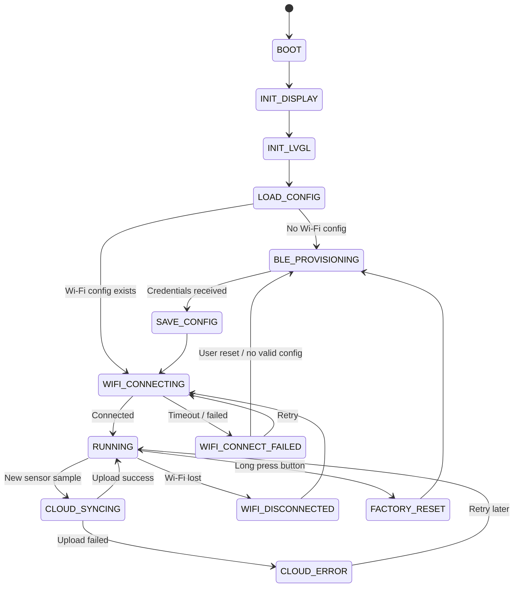

# ESP32-S3 Smart Room Cloud Gateway — Roadmap & Tracking

**Project name:** ESP32-S3 Smart Room Cloud Gateway  
**Target board:** ESP32-S3  
**Main stack:** ESP-IDF, FreeRTOS, Wi-Fi, BLE Provisioning, LVGL, Firebase Realtime Database  
**Created date:** 2026-06-30  
**Owner:** Trần Long Hải  

---

## 1. Project Goal

Build a practical ESP32-S3 IoT device that can:

1. Use **BLE** to configure Wi-Fi credentials.
2. Connect to the internet through **Wi-Fi Station mode**.
3. Display local device status and sensor data on an **LCD using LVGL**.
4. Read sensor data such as temperature/humidity.
5. Upload latest and historical data to a cloud service, initially **Firebase Realtime Database**.
6. Store configuration locally using **NVS**.
7. Support factory reset through a physical button.
8. Be structured as a maintainable embedded project with components, state machine, event flow, logs, and documentation.

This project follows a **project-driven learning approach**: learn ESP-IDF topics just-in-time while building real features.

---

## 2. Final Product Vision

The final device should behave like a small smart room gateway:

```text
First boot / no Wi-Fi config
    ↓
Start BLE provisioning
    ↓
Phone sends Wi-Fi SSID/password
    ↓
ESP32 stores credentials in NVS
    ↓
ESP32 connects to Wi-Fi
    ↓
LCD shows device status, IP, sensor values, cloud sync status
    ↓
ESP32 periodically uploads sensor data to Firebase
```

---

## 3. Core Features

| Feature | Priority | Status | Notes |
|---|---:|---|---|
| LCD bring-up | P0 | Not started | ST7735 / SPI |
| LVGL UI | P0 | Not started | Basic screens and labels |
| Wi-Fi Station | P0 | Not started | Hardcoded credentials first |
| Sensor reading | P0 | Not started | DHT22 or equivalent |
| Firebase upload | P0 | Not started | Realtime Database REST API |
| NVS config storage | P0 | Not started | Store Wi-Fi and device settings |
| BLE Wi-Fi provisioning | P1 | Not started | Prefer ESP-IDF provisioning manager first |
| Button factory reset | P1 | Not started | Long press to erase config |
| Wi-Fi reconnect strategy | P1 | Not started | Event-driven reconnect |
| Cloud retry queue | P1 | Not started | Handle temporary upload failures |
| MQTT | P2 | Not planned | Optional future feature |
| OTA | P2 | Not planned | Final-stage optional feature |
| Custom mobile app | P3 | Not planned | Avoid early scope creep |

Status values:

```text
Not started / In progress / Blocked / Done / Deferred
```

---

## 4. Recommended MVP Scope

The first realistic version should include:

```text
BLE Provisioning
+ Wi-Fi Station
+ LVGL LCD Dashboard
+ Sensor Monitor
+ Firebase Realtime Database Upload
+ NVS Config Storage
+ Button Factory Reset
```

Do **not** add these too early:

```text
Custom mobile app
Firestore direct integration
OTA
MQTT
WebSocket dashboard
BLE always-on streaming
Complex local web dashboard
```

---

## 5. Hardware Plan

| Hardware | Purpose | Required for MVP? | Notes |
|---|---|---:|---|
| ESP32-S3 board | Main controller | Yes | Prefer board with PSRAM if available |
| ST7735 LCD 128x160 | Local UI | Yes | SPI display |
| DHT22 | Temperature/humidity sensor | Yes | Can replace with better sensor later |
| Button | Factory reset / menu input | Yes | Long press detection |
| LED / RGB LED / WS281x | Status indicator | Optional | Useful for quick debugging |
| USB cable | Flash/log monitor | Yes | Use `idf.py monitor` |

---

## 6. Software Architecture

### 6.1 Component Structure

```text
components/
├── app_controller/
├── ble_provisioning/
├── wifi_manager/
├── config_manager/
├── sensor_manager/
├── ui_manager_lvgl/
├── display_driver/
├── cloud_firebase/
├── input_manager/
├── led_manager/
└── common/
```

### 6.2 Component Responsibilities

| Component | Responsibility |
|---|---|
| `app_controller` | Main state machine and feature coordination |
| `ble_provisioning` | BLE-based Wi-Fi provisioning |
| `wifi_manager` | Wi-Fi connection, disconnect, reconnect, events |
| `config_manager` | NVS read/write/erase for credentials and settings |
| `sensor_manager` | Periodic sensor reading and validation |
| `ui_manager_lvgl` | LVGL screen creation and UI updates |
| `display_driver` | LCD SPI init, panel driver, LVGL flush integration |
| `cloud_firebase` | Build JSON payload and upload to Firebase via HTTPS REST |
| `input_manager` | Button, debounce, long press detection |
| `led_manager` | LED status indication |
| `common` | Shared types, events, error codes, utility macros |

---

## 7. System State Machine



---

## 8. Runtime Task/Event Design

### 8.1 Suggested Tasks

| Task | Priority | Responsibility |
|---|---:|---|
| `app_task` | Medium | Main state machine and event handling |
| `ui_task` | Medium | LVGL tick/handler and screen updates |
| `sensor_task` | Low/Medium | Read sensor periodically |
| `cloud_task` | Low/Medium | Upload data to Firebase |
| `input_task` | Medium | Button debounce and long press |

### 8.2 Event Flow

```text
Sensor Task
    ↓ SENSOR_DATA_READY event
App Controller
    ↓ UI_UPDATE event
UI Task / LVGL

App Controller
    ↓ CLOUD_UPLOAD_REQUEST event
Cloud Task
    ↓ CLOUD_UPLOAD_RESULT event
App Controller
    ↓ UI_UPDATE event
UI Task / LVGL
```

### 8.3 Important Rule

Do **not** update LVGL directly from random tasks or callbacks.

Recommended rule:

```text
Only ui_task updates LVGL objects.
Other tasks send events/messages to ui_task.
```

---

## 9. Roadmap by Sprint

## Sprint 0 — Project Setup

**Goal:** Create clean ESP-IDF project structure.

### Tasks

- [ ] Create ESP-IDF project.
- [ ] Set target to ESP32-S3.
- [ ] Create component folders.
- [ ] Add basic logging macro or wrapper.
- [ ] Confirm build/flash/monitor works.
- [ ] Create `README.md` skeleton.

### Commands

```bash
idf.py set-target esp32s3
idf.py build
idf.py flash monitor
```

### Done Criteria

- [ ] Project builds successfully.
- [ ] Firmware boots and prints project name/version.
- [ ] Component structure is ready.

### Learning Topics

- ESP-IDF project layout
- Component CMakeLists
- `idf.py` workflow
- Logging basics

---

## Sprint 1 — LCD + LVGL Bring-up

**Goal:** LCD can display a basic LVGL screen.

### Tasks

- [ ] Bring up ST7735 LCD using SPI.
- [ ] Add LVGL dependency.
- [ ] Configure LVGL tick and handler.
- [ ] Implement display flush callback.
- [ ] Show basic screen with project title.
- [ ] Update a counter label every second.

### Example UI

```text
+----------------+
| Smart Gateway  |
| LVGL: OK       |
| Counter: 001   |
+----------------+
```

### Done Criteria

- [ ] LCD shows correct colors.
- [ ] Text is readable.
- [ ] LVGL screen updates without crash.
- [ ] No direct LVGL update from non-UI tasks.

### Learning Topics

- SPI LCD
- ST7735 init
- RGB565 color format
- LVGL flush callback
- LVGL draw buffer
- UI task concept

### Common Risks

- Wrong LCD init sequence.
- Wrong color order: RGB/BGR.
- Wrong display offset.
- SPI clock too high.
- LVGL buffer too large or too small.

---

## Sprint 2 — Wi-Fi Station + LVGL Status

**Goal:** Connect ESP32-S3 to Wi-Fi using hardcoded credentials and display status on LCD.

### Tasks

- [ ] Implement `wifi_manager`.
- [ ] Connect to Wi-Fi with hardcoded SSID/password.
- [ ] Handle Wi-Fi events.
- [ ] Display Wi-Fi state on LVGL screen.
- [ ] Display IP address after connection.
- [ ] Display RSSI if available.

### Example UI

```text
Wi-Fi: Connected
SSID : Home_WiFi
IP   : 192.168.1.50
RSSI : -55 dBm
```

### Done Criteria

- [ ] Wi-Fi connects reliably.
- [ ] IP is printed in log.
- [ ] IP is shown on LCD.
- [ ] Disconnect event is detected.

### Learning Topics

- `esp_wifi`
- Wi-Fi station mode
- ESP event loop
- IP event
- Reconnect basics

---

## Sprint 3 — Sensor Manager + UI Update

**Goal:** Read sensor periodically and show values on LCD.

### Tasks

- [ ] Implement `sensor_manager`.
- [ ] Read DHT22 every 2 seconds.
- [ ] Validate sensor value range.
- [ ] Send sensor data event to app controller.
- [ ] Update LVGL labels through UI event.

### Example UI

```text
Temp : 28.4 C
Hum  : 70.2 %
Sensor: OK
```

### Done Criteria

- [ ] Sensor data is read periodically.
- [ ] Invalid readings are handled gracefully.
- [ ] UI updates without flicker or crash.
- [ ] Sensor task does not call LVGL directly.

### Learning Topics

- Sensor timing
- Periodic FreeRTOS task
- Queue/event communication
- Data validation

---

## Sprint 4 — Firebase Realtime Database Upload

**Goal:** Upload latest sensor data to Firebase via HTTPS REST API.

### Tasks

- [ ] Create Firebase Realtime Database project.
- [ ] Define database path.
- [ ] Implement `cloud_firebase` component.
- [ ] Build JSON payload.
- [ ] Send HTTPS request using `esp_http_client`.
- [ ] Upload latest sensor value.
- [ ] Display cloud sync status on LCD.

### Suggested Firebase Paths

```text
/smart_room_gateway/device_001/latest.json
/smart_room_gateway/device_001/history/<date>/<sample_id>.json
```

### Example Payload

```json
{
  "temperature": 28.4,
  "humidity": 70.2,
  "wifi_rssi": -55,
  "uptime_sec": 3600,
  "sync_status": "ok"
}
```

### Done Criteria

- [ ] ESP32 can upload one JSON object successfully.
- [ ] Firebase shows latest data.
- [ ] Upload failure is detected.
- [ ] LCD shows `Cloud: Synced` or `Cloud: Error`.

### Learning Topics

- HTTPS client
- JSON payload
- TLS/certificate basics
- Cloud upload retry
- Firebase Realtime Database REST API

### Security Notes

- Do not hardcode sensitive production secrets in public GitHub repos.
- For portfolio demo, use restricted test database rules or a disposable Firebase project.
- Firestore direct integration is not recommended for early stage because authentication is more complex.

---

## Sprint 5 — NVS Config Storage

**Goal:** Store Wi-Fi credentials and device settings in NVS.

### Tasks

- [ ] Implement `config_manager`.
- [ ] Store SSID/password in NVS.
- [ ] Load config at boot.
- [ ] Add config version.
- [ ] Add config erase function.
- [ ] Detect missing/invalid config.

### Example Config Fields

```text
wifi_ssid
wifi_password
device_id
upload_interval_sec
config_version
```

### Done Criteria

- [ ] Config is saved successfully.
- [ ] Config persists after reboot.
- [ ] Missing config is detected.
- [ ] Erase config works.

### Learning Topics

- NVS namespace
- Key-value storage
- Config versioning
- Factory reset behavior

---

## Sprint 6 — BLE Wi-Fi Provisioning

**Goal:** Configure Wi-Fi credentials over BLE instead of hardcoding them.

### Recommended Approach

Start with **ESP-IDF Wi-Fi Provisioning Manager** instead of writing custom BLE GATT from scratch.

### Tasks

- [ ] Add BLE provisioning component.
- [ ] Start provisioning if no Wi-Fi config exists.
- [ ] Send SSID/password from phone/tool.
- [ ] Save credentials to NVS.
- [ ] Stop BLE after provisioning.
- [ ] Connect Wi-Fi using provisioned credentials.
- [ ] Show provisioning status on LVGL.

### Example UI

```text
Mode: BLE Provisioning
Device: SmartGW_001
Status: Waiting for Wi-Fi config
```

### Done Criteria

- [ ] Device advertises BLE provisioning service.
- [ ] Phone/tool can provision Wi-Fi.
- [ ] Credentials are saved.
- [ ] Device connects to Wi-Fi after provisioning.
- [ ] BLE is stopped after provisioning.

### Learning Topics

- BLE provisioning
- Wi-Fi provisioning manager
- BLE vs Wi-Fi coexistence
- Provisioning state flow

### Common Risks

- BLE memory usage.
- Wi-Fi/BLE coexistence behavior.
- Mobile tool/app friction.
- Credentials not saved correctly.

---

## Sprint 7 — Button Factory Reset + Recovery

**Goal:** Add a physical recovery path.

### Tasks

- [ ] Add button input.
- [ ] Implement debounce.
- [ ] Detect long press, for example 5 seconds.
- [ ] Erase Wi-Fi config from NVS.
- [ ] Restart provisioning mode.
- [ ] Display reset confirmation/status on LVGL.

### Done Criteria

- [ ] Short press does not erase config accidentally.
- [ ] Long press reliably resets config.
- [ ] Device returns to provisioning mode.
- [ ] User can recover from wrong Wi-Fi credentials.

### Learning Topics

- GPIO input
- Debounce
- Long press logic
- Safe factory reset flow

---

## Sprint 8 — Reconnect + Cloud Retry

**Goal:** Make the device robust when network/cloud is unstable.

### Tasks

- [ ] Implement Wi-Fi reconnect backoff.
- [ ] Detect disconnected state.
- [ ] Pause Firebase upload when offline.
- [ ] Add retry count.
- [ ] Add simple cloud queue or latest-only retry.
- [ ] Show offline/cloud error state on LVGL.

### Done Criteria

- [ ] Device recovers when Wi-Fi router is turned off/on.
- [ ] Device does not crash when Firebase is unreachable.
- [ ] UI clearly shows offline/error state.
- [ ] Logs are useful for debugging.

### Learning Topics

- Reconnect strategy
- Timeout handling
- Retry/backoff
- Error state design

---

## Sprint 9 — Polish for Portfolio

**Goal:** Make the project presentable for GitHub/CV/interview.

### Tasks

- [ ] Write clean `README.md`.
- [ ] Add architecture diagram.
- [ ] Add state machine diagram.
- [ ] Add setup instructions.
- [ ] Add demo screenshots/photos.
- [ ] Record short demo video.
- [ ] Add known issues section.
- [ ] Add future improvements section.

### Done Criteria

- [ ] Another developer can understand the project from README.
- [ ] Build and setup steps are clear.
- [ ] Architecture is explainable in interview.
- [ ] Project has a clear demo path.

### Learning Topics

- Technical documentation
- Embedded portfolio presentation
- Interview storytelling

---

## 10. Optional Future Features

| Feature | Value | Risk | Recommendation |
|---|---|---:|---|
| MQTT | More IoT-standard | Medium | Add after Firebase works |
| OTA | Very valuable | High | Add near the end |
| Local web dashboard | Useful fallback | Medium | Optional, not MVP |
| Firestore | More scalable cloud DB | High | Avoid early |
| Custom mobile app | Better UX | Very high | Avoid unless needed |
| BLE custom GATT | Deep BLE learning | Medium-high | Do after provisioning manager |
| Sensor history chart on LVGL | Nice UI | Medium | Add if RAM allows |
| Time sync using SNTP | Useful timestamp | Low-medium | Add before historical logging |

---

## 11. Learning Map

| Project Feature | ESP-IDF / Embedded Topics |
|---|---|
| LCD + LVGL | SPI, LCD driver, RGB565, flush callback, UI task |
| Wi-Fi | `esp_wifi`, event loop, IP event, reconnect |
| BLE provisioning | BLE, GATT concept, provisioning manager, coexistence |
| Firebase upload | HTTPS, `esp_http_client`, TLS, JSON, retry |
| NVS | flash key-value storage, config versioning |
| Sensor | GPIO/timing, periodic task, validation |
| Button reset | interrupt/polling, debounce, long press |
| App controller | state machine, event-driven design |
| Robustness | timeout, retry, watchdog later |
| Documentation | README, diagrams, demo, interview explanation |

---

## 12. Definition of Done — Project Level

The project is considered portfolio-ready when:

- [ ] Device can be provisioned through BLE.
- [ ] Device connects to Wi-Fi without hardcoded credentials.
- [ ] LCD shows meaningful LVGL UI.
- [ ] Sensor data is displayed locally.
- [ ] Sensor data is uploaded to Firebase.
- [ ] Wi-Fi config survives reboot.
- [ ] Button factory reset works.
- [ ] Device can recover from Wi-Fi disconnect.
- [ ] Code is split into clear components.
- [ ] README explains setup, architecture, and demo.
- [ ] There is at least one demo video or photo set.

---

## 13. Risk Register

| Risk | Impact | Probability | Mitigation |
|---|---:|---:|---|
| LCD ST7735 init/color issue | Medium | High | Start with LCD-only test project |
| LVGL memory issue | Medium | Medium | Use small draw buffer, simple UI |
| BLE provisioning setup friction | High | Medium | Use ESP-IDF provisioning manager first |
| Wi-Fi/BLE coexistence issue | Medium | Medium | Stop BLE after provisioning |
| Firebase HTTPS/auth issue | High | Medium | Start with Realtime Database REST and test project |
| Task/thread-safety bug with LVGL | High | Medium | Only UI task touches LVGL |
| Scope creep | High | High | Follow sprint order and avoid optional features early |

---

## 14. Development Log Template

Use this section to track daily/weekly progress.

### Log Entry Template

```markdown
## YYYY-MM-DD — <Short title>

### Goal

### What I did

### Result

### Bugs / Issues

### Root cause

### Fix

### What I learned

### Next step
```

---

## 15. Sprint Tracking Board

| Sprint | Name | Status | Start Date | End Date | Notes |
|---:|---|---|---|---|---|
| 0 | Project setup | Not started |  |  |  |
| 1 | LCD + LVGL bring-up | Not started |  |  |  |
| 2 | Wi-Fi + LVGL status | Not started |  |  |  |
| 3 | Sensor + UI update | Not started |  |  |  |
| 4 | Firebase upload | Not started |  |  |  |
| 5 | NVS config storage | Not started |  |  |  |
| 6 | BLE provisioning | Not started |  |  |  |
| 7 | Factory reset | Not started |  |  |  |
| 8 | Reconnect + retry | Not started |  |  |  |
| 9 | Portfolio polish | Not started |  |  |  |

---

## 16. Decision Log

| Date | Decision | Reason | Revisit? |
|---|---|---|---|
| 2026-06-30 | Use project-driven learning instead of learning all ESP32 topics upfront | More practical, less boring, better retention | No |
| 2026-06-30 | Use BLE for Wi-Fi provisioning and Wi-Fi for main operation | Common real-world IoT flow | No |
| 2026-06-30 | Use LVGL for LCD UI | Better local UI structure and portfolio value | No |
| 2026-06-30 | Use Firebase Realtime Database first | Simpler REST flow than Firestore | Yes, after MVP |
| 2026-06-30 | Avoid custom mobile app early | Prevent scope creep | Yes, after MVP |
| 2026-06-30 | Stop BLE after provisioning | Reduce RAM/radio coexistence complexity | No |

---

## 17. Interview/CV Talking Points

After finishing MVP, the project can be described as:

> I built an ESP32-S3 IoT gateway that uses BLE for Wi-Fi provisioning, Wi-Fi for internet connectivity, LVGL for a local LCD dashboard, and Firebase Realtime Database for cloud data logging. The firmware is structured with ESP-IDF components, FreeRTOS tasks, event-driven communication, NVS-based configuration storage, and a state machine for provisioning, connection, running, and recovery states.

Key points to explain in interview:

- Why BLE provisioning is useful.
- Why BLE is stopped after Wi-Fi provisioning.
- How Wi-Fi reconnect is handled.
- How LVGL is updated safely from a UI task.
- How NVS stores configuration.
- How Firebase upload handles failure/retry.
- How the project is split into components.
- What bugs were encountered and how they were debugged.

---

## 18. Immediate Next Step

Start with:

```text
Sprint 0: Project setup
Sprint 1: LCD + LVGL bring-up
```

Do **not** start from BLE or Firebase first.

Reason:

```text
LCD + LVGL gives fast visual feedback.
Wi-Fi/Firebase/BLE can be added after the local UI foundation is stable.
```

---

## 19. Current Project State

```text
Current phase: Planning
Current focus: Prepare roadmap and tracking document
Next action: Create ESP-IDF project skeleton and bring up LCD + LVGL
Main risk: Scope creep from adding too many cloud/network features too early
Recommended discipline: Finish one sprint at a time before adding optional features
```
