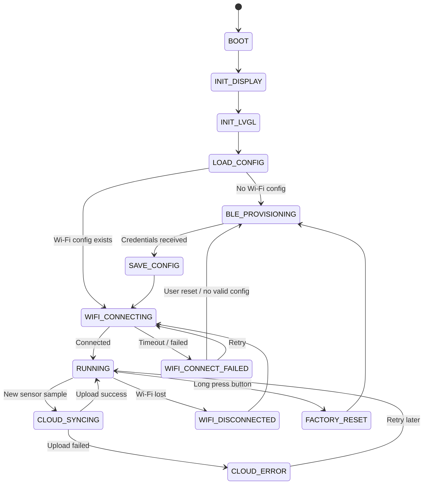

# ESP32-S3 Smart Room Cloud Gateway — Roadmap & Tracking

**Project name:** ESP32-S3 Smart Room Cloud Gateway  
**Target board:** ESP32-S3  
**Main stack:** ESP-IDF, FreeRTOS, Wi-Fi, BLE Provisioning, LVGL, Firebase Realtime Database  
**Created date:** 2026-06-30  
**Owner:** Trần Long Hải  

---

## 1. Project Goal

Build a practical ESP32-S3 IoT device that can:

1. Use **BLE** to configure Wi-Fi credentials.
2. Connect to the internet through **Wi-Fi Station mode**.
3. Display local device status and sensor data on an **LCD using LVGL**.
4. Read sensor data such as temperature/humidity.
5. Upload latest and historical data to a cloud service, initially **Firebase Realtime Database**.
6. Store configuration locally using **NVS**.
7. Support factory reset through a physical button.
8. Be structured as a maintainable embedded project with components, state machine, event flow, logs, and documentation.

This project follows a **project-driven learning approach**: learn ESP-IDF topics just-in-time while building real features.

---

## 2. Final Product Vision

The final device should behave like a small smart room gateway:

```text
First boot / no Wi-Fi config
    ↓
Start BLE provisioning
    ↓
Phone sends Wi-Fi SSID/password
    ↓
ESP32 stores credentials in NVS
    ↓
ESP32 connects to Wi-Fi
    ↓
LCD shows device status, IP, sensor values, cloud sync status
    ↓
ESP32 periodically uploads sensor data to Firebase
```

---

## 3. Core Features

| Feature | Priority | Status | Notes |
|---|---:|---|---|
| LCD bring-up | P0 | Done | ST7735 / SPI hardware-accepted |
| LVGL UI | P0 | Done | Queue-driven screens and labels |
| Wi-Fi Station | P0 | Done | Event-driven Station connection and status UI |
| Sensor reading | P0 | Done | DHT22 manager and stale/error handling |
| Firebase upload | P0 | Done | Authenticated Realtime Database REST PUT verified on hardware |
| NVS config storage | P0 | Done | Integrity, persistence, migration, and recovery tests accepted |
| BLE Wi-Fi provisioning | P1 | In progress | Phase 6.4 implemented; final A-N hardware acceptance pending |
| Button factory reset | P1 | In progress | Phases 7.1-7.3 accepted; Phases 7.4-7.5 implemented with hardware acceptance pending |
| Wi-Fi reconnect strategy | P1 | Done | Event-driven exponential-backoff reconnect owned by `wifi_manager` |
| Cloud retry queue | P1 | Done | Latest-value queue with bounded retry backoff |
| MQTT | P2 | Not planned | Optional future feature |
| OTA | P2 | Not planned | Final-stage optional feature |
| Custom mobile app | P3 | Not planned | Avoid early scope creep |

Status values:

```text
Not started / In progress / Blocked / Done / Deferred
```

**Current milestone (2026-07-28):** Phase 6.4 provisioning UI, bounded session
recovery, and cloud recovery are implemented. Static closure validation is
tracked by Phase 6.4.7; the final A-N target-hardware matrix below remains
pending before Phase 6.4 can be marked complete.

---

## 4. Recommended MVP Scope

The first realistic version should include:

```text
BLE Provisioning
+ Wi-Fi Station
+ LVGL LCD Dashboard
+ Sensor Monitor
+ Firebase Realtime Database Upload
+ NVS Config Storage
+ Button Factory Reset
```

Do **not** add these too early:

```text
Custom mobile app
Firestore direct integration
OTA
MQTT
WebSocket dashboard
BLE always-on streaming
Complex local web dashboard
```

---

## 5. Hardware Plan

| Hardware | Purpose | Required for MVP? | Notes |
|---|---|---:|---|
| ESP32-S3 N16R8 board | Main controller | Yes | 16 MB flash; 8 MiB Octal PSRAM enabled at 80 MHz |
| ST7735 LCD 128x160 | Local UI | Yes | SPI display |
| DHT22 | Temperature/humidity sensor | Yes | Can replace with better sensor later |
| Button | Factory reset / menu input | Yes | Long press detection |
| LED / RGB LED / WS281x | Status indicator | Optional | Useful for quick debugging |
| USB cable | Flash/log monitor | Yes | Use `idf.py monitor` |

---

## 6. Software Architecture

### 6.1 Component Structure

```text
components/
├── cloud/
│   ├── cloud_manager/
│   └── firebase_auth/
├── connectivity/
│   ├── provisioning_manager/
│   └── wifi_manager/
├── display/
│   ├── display_driver/
│   └── waveshare__esp_lcd_st7735/
├── sensing/
│   ├── sensor_manager/
│   └── sensor_DHT22/
├── storage/
│   ├── config_manager/
│   └── sd_card_manager/
├── system/
│   ├── common/
│   └── performance_monitor/
└── ui/
    ├── app_gui/
    ├── ui_manager_lvgl/
    ├── lvgl_image_handler/
    └── lvgl_sd_fs/
```

The first-level directories group reusable ESP-IDF components by domain.
Component names and public APIs remain independent.

### 6.2 Component Responsibilities

| Component | Responsibility |
|---|---|
| `provisioning_manager` | Temporary BLE provisioning transport lifecycle and cleanup |
| `wifi_manager` | Wi-Fi connection, disconnect, reconnect, events |
| `config_manager` | NVS read/write/erase for credentials and settings |
| `sensor_manager` | Periodic sensor reading and validation |
| `sensor_DHT22` | DHT22-specific sampling driver |
| `ui_manager_lvgl` | LVGL initialization, tick, display integration, and mutex ownership |
| `app_gui` | Queue-driven application screens and status rendering |
| `display_driver` | LCD SPI init, panel driver, LVGL flush integration |
| `waveshare__esp_lcd_st7735` | ST7735 panel implementation used by the display driver |
| `lvgl_image_handler` | Image decoding, scaling, animation, and LVGL image object handling |
| `lvgl_sd_fs` | LVGL file-system bridge for SD-card content |
| `sd_card_manager` | SD-card mount, file access, and diagnostic helpers |
| `firebase_auth` | Firebase sign-in, ID-token validation, caching, and refresh |
| `cloud_manager` | Build telemetry JSON and upload it to Firebase via authenticated HTTPS REST |
| `common` | Shared types, events, error codes, utility macros |
| `performance_monitor` | Runtime CPU, memory, and task-stack diagnostics |

---

## 7. System State Machine



---

## 8. Runtime Task/Event Design

### 8.1 Suggested Tasks

| Task | Priority | Responsibility |
|---|---:|---|
| `app_task` | Medium | Main state machine and event handling |
| `ui_task` | Medium | LVGL tick/handler and screen updates |
| `sensor_task` | Low/Medium | Read sensor periodically |
| `cloud_task` | Low/Medium | Upload data to Firebase |
| `input_task` | Medium | Button debounce and long press |

### 8.2 Event Flow

```text
Sensor Task
    ↓ SENSOR_DATA_READY event
App Controller
    ↓ UI_UPDATE event
UI Task / LVGL

App Controller
    ↓ CLOUD_UPLOAD_REQUEST event
Cloud Task
    ↓ CLOUD_UPLOAD_RESULT event
App Controller
    ↓ UI_UPDATE event
UI Task / LVGL
```

### 8.3 Important Rule

Do **not** update LVGL directly from random tasks or callbacks.

Recommended rule:

```text
Only ui_task updates LVGL objects.
Other tasks send events/messages to ui_task.
```

---

## 9. Roadmap by Sprint

## Sprint 0 — Project Setup

**Goal:** Create clean ESP-IDF project structure.

### Tasks

- [x] Create ESP-IDF project.
- [x] Set target to ESP32-S3.
- [x] Create component folders.
- [x] Add project logging conventions.
- [x] Confirm build/flash/monitor works.
- [x] Create project and component documentation.

### Commands

```bash
idf.py set-target esp32s3
idf.py build
idf.py flash monitor
```

### Done Criteria

- [x] Project builds successfully.
- [x] Firmware boots and prints project name/version.
- [x] Component structure is ready.

### Learning Topics

- ESP-IDF project layout
- Component CMakeLists
- `idf.py` workflow
- Logging basics

---

## Sprint 1 — LCD + LVGL Bring-up

**Goal:** LCD can display a basic LVGL screen.

### Tasks

- [x] Bring up ST7735 LCD using SPI.
- [x] Add LVGL dependency.
- [x] Configure LVGL tick and handler.
- [x] Implement display flush callback.
- [x] Show basic screen with project title.
- [x] Update a counter label periodically during bring-up.

### Example UI

```text
+----------------+
| Smart Gateway  |
| LVGL: OK       |
| Counter: 001   |
+----------------+
```

### Done Criteria

- [x] LCD shows correct colors.
- [x] Text is readable.
- [x] LVGL screen updates without crash.
- [x] No direct LVGL update from non-UI tasks.

### Learning Topics

- SPI LCD
- ST7735 init
- RGB565 color format
- LVGL flush callback
- LVGL draw buffer
- UI task concept

### Common Risks

- Wrong LCD init sequence.
- Wrong color order: RGB/BGR.
- Wrong display offset.
- SPI clock too high.
- LVGL buffer too large or too small.

---

## Sprint 2 — Wi-Fi Station + LVGL Status

**Goal:** Connect ESP32-S3 to Wi-Fi using hardcoded credentials and display status on LCD.

### Tasks

- [x] Implement `wifi_manager`.
- [x] Connect to Wi-Fi with development SSID/password.
- [x] Handle Wi-Fi and DHCP events.
- [x] Display Wi-Fi state on the LVGL screen.
- [x] Display the IP address after connection.
- [ ] Display RSSI. Deferred; RSSI is transported but is not currently shown.

### Example UI

```text
Wi-Fi: Connected
SSID : Home_WiFi
IP   : 192.168.1.50
RSSI : -55 dBm
```

### Done Criteria

- [x] Wi-Fi connects reliably.
- [x] IP is printed in log.
- [x] IP is shown on LCD.
- [x] Disconnect event is detected.

### Learning Topics

- `esp_wifi`
- Wi-Fi station mode
- ESP event loop
- IP event
- Reconnect basics

---

## Sprint 3 — Sensor Manager + UI Update

**Goal:** Read sensor periodically and show values on LCD.

### Tasks

- [x] Implement `sensor_manager`.
- [x] Read DHT22 every 2 seconds.
- [x] Validate sensor value range.
- [x] Send sensor data event to the application layer.
- [x] Update LVGL labels through the GUI queue.

### Example UI

```text
Temp : 28.4 C
Hum  : 70.2 %
Sensor: OK
```

### Done Criteria

- [x] Sensor data is read periodically.
- [x] Invalid readings are handled gracefully.
- [x] UI updates without flicker or crash.
- [x] Sensor task does not call LVGL directly.

### Hardware Acceptance Result

Sensor updates, stale/error handling, LVGL rendering, and task stability were
accepted on the target hardware before Sprint 4 began.

### Learning Topics

- Sensor timing
- Periodic FreeRTOS task
- Queue/event communication
- Data validation

---

## Sprint 4 — Firebase Realtime Database Upload

**Goal:** Upload latest sensor data to Firebase via HTTPS REST API.

### Tasks

- [x] Create Firebase Realtime Database project.
- [x] Define the authenticated latest-value database path.
- [x] Implement `firebase_auth` and `cloud_manager` components.
- [x] Build a bounded JSON telemetry payload.
- [x] Send authenticated HTTPS requests using `esp_http_client`.
- [x] Upload the latest sensor snapshot.
- [x] Display cloud sync/error status on the Sensor LCD screen.

### Suggested Firebase Paths

```text
/devices/esp32s3-001/latest.json
```

Historical storage remains outside Sprint 4; this phase intentionally owns
only the latest-value path.

### Example Payload

```json
{
  "temperature_c": 28.4,
  "humidity_percent": 70.2,
  "sensor_valid": true,
  "sensor_stale": false,
  "sensor_state": 3,
  "last_error": 0,
  "sample_uptime_ms": 3600000,
  "source": "esp32_cloud_manager"
}
```

### Done Criteria

- [x] ESP32 uploads authenticated JSON successfully.
- [x] Firebase shows the latest sensor data at the configured device path.
- [x] Authentication, transport, and HTTP upload failures are detected.
- [x] LCD shows the live Cloud state: `Wait`, `Sync`, `Online`, `Retry`,
  `Auth`, or `Error`.

### Hardware Acceptance Result

Accepted on 2026-07-19:

- [x] Firebase Email/Password authentication succeeds on the ESP32-S3.
- [x] The ESP32-S3 receives a successful Firebase HTTPS response.
- [x] Firebase data changes from firmware telemetry uploads.
- [x] The LCD Cloud indicator follows upload and failure states.
- [x] Failure/retry handling runs without a watchdog reset, crash, or reboot.

### Learning Topics

- HTTPS client
- JSON payload
- TLS/certificate basics
- Cloud upload retry
- Firebase Realtime Database REST API

### Security Notes

- Do not hardcode sensitive production secrets in public GitHub repos.
- For portfolio demo, use restricted test database rules or a disposable Firebase project.
- Firestore direct integration is not recommended for early stage because authentication is more complex.

---

## Sprint 5 — NVS Config Storage

**Goal:** Store Wi-Fi credentials and device settings in NVS.

### Tasks

- [x] Implement `config_manager`.
- [x] Store SSID/password in NVS.
- [x] Load valid persisted config at boot.
- [x] Add schema version policy and explicit legacy migration.
- [x] Add Wi-Fi clear and component factory reset.
- [x] Detect missing/incomplete/invalid/unsupported/legacy config.
- [x] Add optional device identity persistence.
- [x] Add isolated Sprint 5 fault-injection and hardening tests.

### Example Config Fields

```text
wifi_ssid
wifi_password
device_id
upload_interval_sec
config_version
```

### Done Criteria

- [x] Config is saved successfully.
- [ ] Config persists after reboot.
- [x] Missing config is detected.
- [x] Wi-Fi erase works.
- [ ] Updated 38-case Sprint 5 suite passes on ESP32-S3 hardware.
- [ ] Production boot state matrix passes on ESP32-S3 hardware.

### Verification Status

- Production firmware compile/link after hardening: passed with ESP-IDF v6.0.1.
- Renamed 38-case `Test/config_manager` firmware compile/link: passed.
- Historical 14-case Phase 5.3B hardware suite: passed.
- Previous 37-case expanded hardware suite: passed.
- Updated 38-case runtime, reboot persistence, and production boot-state
  tests: pending hardware.

### Learning Topics

- NVS namespace
- Key-value storage
- Config versioning
- Factory reset behavior

---

## Sprint 6 — BLE Wi-Fi Provisioning

**Goal:** Configure Wi-Fi credentials over BLE instead of hardcoding them.

### Recommended Approach

Start with **ESP-IDF Wi-Fi Provisioning Manager** instead of writing custom BLE GATT from scratch.

### Phase 6.1 Status — Complete

- [x] Add the reusable `provisioning_manager` component.
- [x] Initialize the Espressif BLE provisioning scheme.
- [x] Advertise a MAC-derived service using Security 1.
- [x] Verify thread-safe start/stop lifecycle state transitions.
- [x] Stop BLE and de-initialize provisioning resources without deadlock.
- [x] Document the public API, ownership boundaries, and cleanup behavior.

Phase 6.1 is limited to controlled BLE bring-up and cleanup. Credential
reception, validation, NVS handoff, Station connection, and GUI integration
are completed in Phase 6.2.

### Phase 6.2 Status — Complete

- [x] Start provisioning only for `NOT_CONFIGURED`.
- [x] Validate and deep-copy framework-owned credentials.
- [x] Hand credentials to the application only after Wi-Fi success.
- [x] Discard pending credentials after a failed connection attempt.
- [x] Persist credentials only through `config_manager`.
- [x] Verify configuration state and read-back before continuing.
- [x] Recover safely from an injected NVS persistence failure.
- [x] Stop BLE, release provisioning resources, and let `wifi_manager` adopt
  the active Station connection.
- [x] Remove temporary fault-injection code after hardware acceptance.

### Phase 6.3 Status - In Progress

#### Checkpoint 6.3.2 - Dedicated Coordinator Task - Complete

- [x] Run boot policy and bounded provisioning in a dedicated one-shot task.
- [x] Keep `app_main()` responsive while BLE provisioning waits for input.
- [x] Preserve `config_manager`, `provisioning_manager`, and `wifi_manager`
  ownership during credential persistence, cleanup, and connection adoption.
- [x] Expose network readiness only after provisioning adoption completes.
- [x] Defer the 12 KB cloud task until stored connection startup or completed
  provisioning handoff, with retry after temporary allocation pressure.
- [x] Preserve queue-driven Wi-Fi and cloud GUI updates without direct LVGL
  calls from callbacks.
- [x] Verify timeout, reset, reprovision, Wi-Fi connection, Firebase upload,
  and GUI cloud-state recovery on hardware.

Checkpoint 6.3.2 was hardware-accepted by the user on 2026-07-26. Phase 6.3
remains in progress; this checkpoint does not complete its remaining work.

#### Checkpoint 6.3.3 - Runtime Network State Synchronization - Complete

- [x] Forward task-context Wi-Fi manager snapshots into the application
  network coordinator.
- [x] Track runtime `CONNECTING`, `ONLINE`, and `OFFLINE` transitions after
  normal Station ownership begins.
- [x] Ignore transient provisioning Wi-Fi events until persistence, BLE
  cleanup, and connection adoption complete.
- [x] Preserve `wifi_manager` ownership of connection and reconnect behavior.
- [x] Preserve queue-driven GUI updates without calling LVGL from the Wi-Fi
  callback.

Checkpoint 6.3.3 was hardware-accepted by the user on 2026-07-26. Phase 6.3
remains in progress; provisioning-status UI work is still pending.

#### Checkpoint 6.3.4 - Application Service Lifecycle Separation - Implemented

- [x] Initialize Firebase Authentication and the cloud telemetry queue before
  starting the sensor producer.
- [x] Run sensor sampling as a local service independent of network success.
- [x] Schedule network orchestration only after local producers and consumer
  queues are ready.
- [x] Gate the memory-heavy cloud task on coordinator `CONNECTING` or `ONLINE`
  states that cannot overlap active BLE provisioning.
- [x] Recover a `GOT_IP` event near the provisioning deadline through one
  bounded handoff grace, followed when needed by clean BLE teardown and a
  generation-bound 5-second DHCP settle.
- [x] Confirm late credentials only when the active Station has IPv4 and its
  SSID exactly matches the pending candidate; otherwise zeroize and detach the
  unadopted attempt before retry.
- [x] Keep sensor, cloud, Wi-Fi, provisioning, GUI, and coordinator ownership
  within their existing components.
- [x] Build and statically review callback, queue, critical-section, and
  credential-handling paths.
- [ ] Confirm provisioning, late-DHCP recovery, GUI/sensor responsiveness,
  reconnect, watchdog, and Firebase recovery behavior on hardware.

Checkpoint 6.3.4 is implemented and statically verified. Hardware acceptance
is not yet claimed, and Phase 6.3 remains in progress.

### Phase 6.4.3 Status - Implemented / Hardware Test Pending

- [x] Build QR JSON from the exact active BLE service using Espressif's
  `v1`, Security 1, and `ble` schema.
- [x] Configure BT/NimBLE, Security 1, and LVGL QR support through
  `sdkconfig.defaults`.
- [x] Match the official `wifi_prov` example's five framework Wi-Fi
  connection attempts.
- [x] Copy the QR payload through coordinator and GUI-owned queues without
  logging PoP or credentials.
- [x] Render the QR with LVGL at the largest integer module scale that fits
  the 160x128 screen and a standards-compliant quiet zone.
- [x] Preserve provisioning, Wi-Fi manager, config manager, and LVGL ownership.
- [x] Confirm QR scanning and BLE Wi-Fi credential handoff on hardware.

The user confirmed QR scanning and a successful provisioned Wi-Fi connection
on target hardware. Cross-phase GUI, retry, cloud, and endurance acceptance
remain covered by the final A-N matrix.

### Phase 6.4.4 Status - Implemented / Hardware Test Pending

- [x] Publish copied, non-sensitive provisioning manager progress outside its
  lifecycle critical section.
- [x] Bridge the existing single Wi-Fi callback into real association, DHCP,
  and disconnect provisioning states without promoting application `ONLINE`.
- [x] Deliver provisioning status through a dedicated length-one overwrite
  queue rather than the screen-command queue.
- [x] Make the GUI QR cache session-owned and clear it only through explicit
  session invalidation.
- [x] At this checkpoint, keep ordinary credential failure non-terminal; this
  behavior is superseded by the framework-failure hardening in Phase 6.4.5.
- [x] Map verified persistence, cleanup, and adoption to
  `SAVING_CONFIG -> CLEANING_UP -> SUCCESS`.
- [x] Hold `SUCCESS` for 1500 ms, request `WIFI_STATUS`, and preserve the
  existing timeout route to `SENSOR_DASHBOARD`.
- [x] Keep automatic `RETRYING` and session restart outside this checkpoint.
- [ ] Confirm progress ordering, wrong-password replacement-session recovery,
  timeout cleanup, success dwell, and final routing on hardware.

Phase 6.4.4 is implemented and build-verified. Hardware acceptance remains
pending; automatic retry/restart was deferred to Phase 6.4.5 at that
checkpoint and is now implemented. Final Phase 6.4 hardware acceptance remains
pending.

### Phase 6.4.5 Status - Implemented / Hardware Test Pending

- [x] Add a three-session default retry envelope with 1000 ms failure dwell
  and 1500 ms retry backoff.
- [x] Reinitialize `provisioning_manager` only after clean `STOPPED` and reuse
  and reset its single credential queue.
- [x] Publish framework credential exhaustion as a non-sensitive failure.
  The 2026-08-01 selective restore no longer promotes this event to an
  immediate terminal generation change; bounded session timeout owns cleanup,
  matching `e66adb3`.
- [x] Classify retryable timeout/session failure separately from storage,
  adoption, and internal failures.
- [x] Attach a non-zero generation to manager progress, GUI status, QR update,
  and QR clear messages; reject stale generations.
- [x] Show the active one-based provisioning session and configured maximum as
  `Session n/max` on the QR screen without reducing QR size.
- [x] Retain BLE controller memory between retries and release it when the
  bounded envelope terminates.
- [x] Preserve coordinator `PROVISIONING` and cloud gating during retry; keep
  final exhaustion on the Provisioning Screen without reboot.
- [x] Preserve the successful Phase 6.4.4 cleanup, adoption, success dwell,
  and final screen routing.
- [ ] Confirm timeout retry, replacement-session password correction,
  exhaustion, second-session success, stale-event rejection, injected failures, and
  30-60-minute resource stability on hardware.

Phase 6.4.5 is implemented and statically build-verified. Hardware acceptance
remains part of the final A-N matrix.

### Phase 6.4.6 Status - Implemented / Hardware Test Pending

- [x] Feed the cloud manager from the existing Wi-Fi callback through a
  non-blocking IPv4 state and non-zero network epoch.
- [x] Replace blind cloud retry delays with task-notification waits that wake
  for network edges and telemetry without allowing telemetry hot loops.
- [x] Reset the single task-owned HTTP client on network/token generation,
  transport, HTTP 0/401/403/408/429/5xx, and terminal request failures.
- [x] Classify cloud attempts explicitly instead of treating every HTTP status
  zero as retryable.
- [x] Add bounded HTTP 401 recovery and at most one forced token recovery for a
  persistent HTTP 403 rejection.
- [x] Split Firebase Authentication operation serialization from short
  token/status state protection and expose observable token invalidation.
- [x] Preserve the latest-value telemetry queue across retries and the
  new-sample-during-request race.
- [x] Correct the ESP32-S3/NimBLE terminal release to
  `esp_bt_mem_release(ESP_BT_MODE_BLE)` after clean `STOPPED`.
- [x] Make BLE memory reclamation best-effort so it cannot replace successful
  adoption or an existing provisioning failure.
- [x] Preserve one cloud task, one Wi-Fi callback, provisioning/cloud gating,
  certificate verification, Firebase endpoint, and GUI mappings.
- [ ] Confirm normal upload, reconnect-during-backoff, transport and HTTP
  recovery, 401/403 policy, latest telemetry, provisioning regression, token
  refresh, and two-hour resource stability on hardware.

Phase 6.4.6 is implemented and statically build-verified. Hardware acceptance
remains part of the final A-N matrix.

### Phase 6.4.7 Status - Implemented / Hardware Regression Pending

- [x] Verify the Phase 6.4.1-6.4.6 prerequisite architecture and component
  ownership.
- [x] Review queues, callbacks, tasks, mutexes, generations, cleanup, boot
  policy, provisioning retry, cloud recovery, and cloud-start gating.
- [x] Remove stale closure documentation and confirm no temporary production
  fault driver remains.
- [x] Preserve the original BLE service-start error when subsequent framework
  cleanup also fails, while keeping the manager in `FAILED`.
- [x] Overwrite retained FreeRTOS credential-queue storage after handoff,
  before session reset, and at terminal BLE release.
- [x] Clean partial `ui_manager_lvgl` initialization resources and allow a
  safe same-boot retry after initialization failure.
- [x] Settle Firebase Auth diagnostics and clear partial request buffers when
  sign-in/refresh fails before HTTP begins.
- [x] Document the final ownership model, known limitations, and A-N hardware
  regression matrix.
- [ ] Execute the final A-N matrix on the ESP32-S3 target.

**Phase 6.4.7 - IMPLEMENTED / HARDWARE REGRESSION PENDING**

**Phase 6.4 - IMPLEMENTED / FINAL HARDWARE ACCEPTANCE PENDING**

Build and static checks establish review readiness but do not prove BLE,
Wi-Fi, LCD, TLS, Firebase, heap, or endurance behavior on the target. Only the
matrix below can close the remaining hardware acceptance.

### Phase 6.4 Final Hardware Acceptance Matrix

Use a serial monitor at the default project log level. Do not enable logging
that prints provisioning session material. Record the firmware revision,
board, power source, AP/hotspot, phone provisioning application, and duration.

#### A. Configured-device boot

1. Reboot with a valid stored configuration.
2. Verify `BOOT -> WIFI_STATUS -> SENSOR_DASHBOARD -> Cloud Online`.
3. Verify BLE provisioning does not start.

#### B. First-session provisioning success

1. Erase only the application Wi-Fi configuration through an approved test
   procedure.
2. Verify direct `PROVISIONING` display with no `BOOT` flash and a scannable
   QR.
3. Submit correct credentials.
4. Verify `SUCCESS -> WIFI_STATUS -> SENSOR_DASHBOARD -> Cloud Online`.

#### C. Wrong password then correct password

1. Submit a wrong password and verify `FAILED`.
2. Verify no application-forced immediate generation change. Let bounded
   timeout/manager cleanup complete before any replacement session.
3. Submit the correct password when the framework/session permits and verify
   the normal success flow.

#### D. Timeout and replacement session

1. Let session 1 expire.
2. Verify `TIMEOUT -> CLEANING_UP -> RETRYING`.
3. Verify session 2 starts only after manager `STOPPED`, shows a current QR,
   and accepts correct credentials to complete successfully.

#### E. Retry exhaustion

1. Let every configured session expire.
2. Verify exactly the configured number of sessions, final `TIMEOUT` or
   `FAILED`, hidden/invalidated QR, no extra session, no reboot, and no cloud
   start.

#### F. Reboot persistence

1. Provision successfully, then power-cycle the board.
2. Verify stored-config boot and no provisioning screen or BLE service.

#### G. Runtime Wi-Fi disconnect

1. During configured runtime, turn the AP/hotspot off and then on.
2. Verify `wifi_manager` reconnect backoff restores Wi-Fi.
3. Verify no provisioning screen, config erase, or coordinator provisioning
   restart occurs.

#### H. Cloud network recovery

1. Begin at `Cloud Online`, turn the AP/hotspot off, and verify `Cloud Wait`.
2. Restore the AP/hotspot and verify `Cloud Sync -> Cloud Online`.

#### I. Internet-only failure

1. Keep Wi-Fi associated with a valid IPv4 address while removing Internet
   access.
2. Verify `Cloud Retry` with bounded backoff.
3. Restore Internet and verify `Cloud Online`.

#### J. Cloud wake during long backoff

1. Allow cloud retry to reach a long delay.
2. Recover the network before the deadline.
3. Verify prompt task wake, network-epoch client reset, newest telemetry
   upload, and `Cloud Online`.

#### K. Retryable HTTP or transport fault

1. Use a controlled external failure that does not require production
   fault-injection code.
2. Verify transport/TLS/DNS failure or HTTP 408/429/5xx produces bounded
   `Retry`, a clean client reset, and recovery to `Online`.

#### L. Authentication recovery

1. Reject the active token and verify bounded invalidation, token recovery,
   and return to `Online`.
2. Sustain an authorization rejection and verify terminal `Auth Error`
   without a hot sign-in loop.

#### M. Latest telemetry

1. Produce several sensor samples during an outage and active retry.
2. Restore service and verify the newest pending sample reaches Firebase;
   historical samples are not expected.

#### N. Endurance

Run for at least 2 hours; 4-8 hours is recommended. During the run:

- repeat Wi-Fi disconnect/reconnect;
- repeat an Internet-only outage;
- keep sensor updates active;
- exercise cloud retry and recovery;
- exercise screen transitions;
- include at least one provisioning retry when practical.

Acceptance for A-N requires:

- no Guru Meditation, watchdog, stack overflow, or LVGL assertion;
- no continuous heap-loss trend;
- no duplicate task or callback;
- no stale screen object or provisioning-session collision;
- no cloud-client leak;
- no sensitive serial output.

### Phase 6.4 Known Limitations

- No manual SSID/password entry UI or touch retry button.
- No runtime user-triggered reprovisioning or factory-reset UI.
- Proof of Possession is a static development value; there is no
  device-specific protected manufacturing flow.
- Firebase device credentials still depend on the current development
  configuration model and must move to protected local configuration before
  production/publication.
- Telemetry is latest-value only; there is no offline history or SD-backed
  cloud queue.
- The one-shot cloud service has no public stop/deinit or operator restart API;
  terminal `AUTH_ERROR` and deterministic `ERROR` remain latched.
- MQTT, OTA, cloud command reception, a custom mobile app, and dashboard
  redesign remain out of scope.

### Tasks

- [x] Add BLE provisioning component.
- [x] Start provisioning if no Wi-Fi config exists.
- [x] Send SSID/password from phone/tool.
- [x] Save credentials to NVS.
- [x] Stop BLE after provisioning.
- [x] Connect Wi-Fi using provisioned credentials.
- [x] Show provisioning status on LVGL.

### Example UI

```text
Mode: BLE Provisioning
Device: SmartGW_001
Status: Waiting for Wi-Fi config
```

### Done Criteria

- [x] Device advertises BLE provisioning service.
- [x] Phone/tool can provision Wi-Fi.
- [x] Credentials are saved and read back.
- [x] Device connects to Wi-Fi after provisioning.
- [x] BLE is stopped after provisioning.

### Learning Topics

- BLE provisioning
- Wi-Fi provisioning manager
- BLE vs Wi-Fi coexistence
- Provisioning state flow

### Common Risks

- BLE memory usage.
- Wi-Fi/BLE coexistence behavior.
- Mobile tool/app friction.
- Credentials not saved correctly.

---

## Sprint 7 — Button Factory Reset + Recovery

**Goal:** Add a physical recovery path.

### Phase 7.1 Status — Complete

- [x] Add the independent `button_manager` component and input domain.
- [x] Configure GPIO 9 as an active-low polled input with internal pull-up.
- [x] Debounce stable press/release transitions using a 10 ms poll period and
      40 ms debounce interval.
- [x] Publish one copied `PRESSED`, `RELEASED`, and one-shot `LONG_PRESS` event
      from the button task without blocking or calling LVGL.
- [x] Integrate non-fatal button startup and diagnostic event handling in
      `main` without taking over storage, Wi-Fi, provisioning, or GUI ownership.
- [x] Document lifecycle, callback context, timing, ownership, and deferred work.

Phase 7.1 was manually/hardware accepted by the user on 2026-08-01. This
completes only physical input, debounce, and event publication. It does not
complete Sprint 7: configuration clearing, provisioning restart, reset UI, and
end-to-end recovery remain pending.

### Phase 7.2 Status — Complete

- [x] Add the independent `app_reset_coordinator` application component.
- [x] Start the coordinator before button event publication can begin.
- [x] Forward copied button events through a zero-wait queue operation.
- [x] Validate press, long-press, and release ordering in a dedicated task.
- [x] Accept at most one diagnostic reset request per physical press cycle.
- [x] Keep storage, Wi-Fi, provisioning, reboot, and LVGL work outside the
      button callback and outside the Phase 7.2 scope.
- [x] Document lifecycle, task context, ownership, failure behavior, and
      deferred reset execution.

Phase 7.2 was manually/hardware accepted by the user on 2026-08-01. This
completes only non-blocking reset-input handoff and one-shot request
qualification. It does not complete Sprint 7: no configuration is erased and
no provisioning, reboot, or reset-confirmation UI action is performed.

### Phase 7.3 Status — Complete

- [x] Remove the second persistent Station configuration written by the
      upstream provisioning framework through a `wifi_manager`-owned wrapper.
- [x] Clear application-owned Wi-Fi keys only through `config_manager`.
- [x] Re-open and verify the resulting state is `NOT_CONFIGURED`.
- [x] Suppress reboot when either persistent cleanup layer fails.
- [x] Reboot after successful cleanup so live Wi-Fi, DHCP, reconnect, cloud,
      and coordinator state cannot survive into provisioning.
- [x] Reprovision without `erase-flash` and receive a valid IPv4 address.
- [x] Preserve device identity, custom configuration, callback safety, and
      credential-free logs.

Phase 7.3 was manually/hardware accepted by the user on 2026-08-01. This
completes verified Wi-Fi reset and reboot-to-provisioning recovery. Sprint 7
remains incomplete. Reset confirmation is implemented by Phase 7.4, and active
provisioning reset coordination is implemented by Phase 7.5. Hardware
acceptance remains pending for both checkpoints.

### Phase 7.4 Status - Implemented / Hardware Acceptance Pending

- [x] Add a dedicated `RESET_RESULT` screen for reset success and failure.
- [x] Copy reset results through the existing GUI command queue; only the GUI
      task creates or updates LVGL objects.
- [x] Assign a non-zero boot-local transaction ID to each accepted reset and
      acknowledge only the exact result rendered for that transaction.
- [x] Publish acknowledgment only after reset content is rendered and the
      following `lv_timer_handler()` pass completes.
- [x] Wait at most 500 ms for acknowledgment and hold confirmed success for
      1500 ms.
- [x] Use a bounded 500 ms fallback when GUI queueing, construction, or
      acknowledgment fails; GUI failure never suppresses a verified reboot.
- [x] Keep persistent cleanup failures non-rebooting and retryable only after
      `RELEASED` re-arms the input transaction.
- [x] Preserve the previous screen and every widget reference when reset-screen
      construction or cached rendering fails.
- [x] Validate with `idf.py build` on ESP-IDF 6.0.1.
- [ ] Validate success, failure, fallback, retry, stack, and heap behavior on
      target hardware.

Phase 7.4 is build-verified but is not complete until the hardware checklist
passes. A GUI presentation acknowledgment proves a matching LVGL render plus a
completed handler pass; it does not claim direct physical LCD flush feedback.

### Phase 7.5 Status - Implemented / Hardware Acceptance Pending

- [x] Add a bounded synchronous factory-reset preparation API to
      `app_network_coordinator`.
- [x] Close an application reset gate before provisioning lifecycle cleanup.
- [x] Prevent new sessions, retries, persistence, adoption, and normal routing
      after reset wins.
- [x] Wait for an already-claimed credential handoff before persistent erasure.
- [x] Drain and securely clear a verified handoff that loses the reset race
      after the framework reaches a producer-free lifecycle state.
- [x] Stop ACTIVE provisioning and poll STARTING/STOPPING within one finite
      10-second reset-coordinator deadline.
- [x] Disable Station reconnect, force a driver detach even when cached manager
      state is stale, and confirm `DISCONNECTED` within the same deadline.
- [x] Serialize manager-owned connect, disconnect, cleanup, and restore driver
      commands so a reconnect cannot race persistent Wi-Fi erasure.
- [x] Treat manager FAILED as fail-safe and roll back a newly claimed gate on
      preparation failure.
- [x] Keep preparation failure non-erasing and non-rebooting while preserving
      the Phase 7.4 reset-result flow.
- [x] Reuse existing tasks, queues, locks, and provisioning-manager APIs.
- [x] Validate an ESP-IDF 6.0.1 clean build with project warning flags.
- [ ] Validate reset from UNINITIALIZED, READY, STARTING, ACTIVE, STOPPING,
      STOPPED, and FAILED manager states on target hardware.
- [ ] Race reset against queued credentials, NVS persistence, cleanup,
      connection adoption, and the success dwell on target hardware.
- [ ] Validate reset while Station is `CONNECTED`, `WAITING_FOR_IP`, and
      `RETRY_WAIT`, including a reconnect command racing reset.

Phase 7.5 is implemented but is not complete until the hardware race matrix
passes. A successful preparation leaves the reset gate asserted until reboot;
only then may driver and application Wi-Fi persistence be cleared.

The current DHCP/resource hardening is build-verified but hardware acceptance
is pending. The N16R8 target now enables its 8 MiB Octal PSRAM and explicitly
routes NimBLE's dynamic pools through the external allocator. Ordinary
allocations larger than 16 KB prefer PSRAM, while a 32 KB internal reserve
protects internal/DMA-capable requests. Wi-Fi/lwIP is not explicitly redirected;
LCD DMA buffers and Phase 7 task stacks are not moved. ESP-NETIF still owns
DHCP; the application does not start or stop the client after association.

When the 120-second session and its pending-handoff 30-second IPv4 grace both
expire, the coordinator performs generation-bound final queue drains, holds the
existing Phase 7 reset exclusion, and stops/deinitializes BLE to clean
`STOPPED`. It then gives the associated Station at most 5 seconds to settle
DHCP. Credentials advance to persistence/read-back/adoption only if the active
Station SSID exactly matches the candidate and a valid IPv4 address is present.
Every timeout, mismatch, error, or reset race securely clears local and queued
credential copies and discards retained pending data; ordinary failure also
detaches the unadopted Station before retry. Phase 7 reset gating, exclusion,
quiescence, and non-erasing failure policy remain unchanged. Target-hardware
acceptance is still required and no runtime fix is claimed by the build alone.

### Tasks

- [x] Add button input.
- [x] Implement debounce.
- [x] Detect long press, for example 5 seconds.
- [x] Erase Wi-Fi config from NVS.
- [x] Restart provisioning mode.
- [x] Display reset confirmation/status on LVGL.

### Done Criteria

- [x] Short press does not erase config accidentally.
- [x] Long press reliably resets config.
- [x] Device returns to provisioning mode.
- [x] User can recover from wrong Wi-Fi credentials.

### Learning Topics

- GPIO input
- Debounce
- Long press logic
- Safe factory reset flow

---

## Sprint 8 — Reconnect + Cloud Retry — Complete

**Goal:** Make the device robust when network/cloud is unstable.

### Tasks

- [x] Implement Wi-Fi reconnect backoff.
- [x] Detect disconnected state.
- [x] Pause Firebase upload when offline.
- [x] Add retry count.
- [x] Add simple cloud queue or latest-only retry.
- [x] Show offline/cloud error state on LVGL.

### Done Criteria

- [x] Device recovers when Wi-Fi router is turned off/on.
- [x] Device does not crash when Firebase is unreachable.
- [x] UI clearly shows offline/error state.
- [x] Logs are useful for debugging.

### Hardware Acceptance Result

Accepted by the user on 2026-08-02 after completing the planned target-hardware
reconnect, cloud retry, UI-state, logging, and stability checks.

- [x] Wi-Fi reconnect and IPv4 recovery succeed after router/hotspot loss.
- [x] Cloud upload pauses or retries with bounded behavior while unavailable.
- [x] Cloud upload resumes after connectivity is restored.
- [x] Latest-value telemetry behavior remains functional during recovery.
- [x] Offline, retry, synchronization, online, and error states remain visible
      through the queue-driven GUI path.
- [x] No crash, watchdog reset, or blocking recovery failure was observed in
      the completed Phase 8 test steps.

**Sprint 8 — COMPLETE / USER HARDWARE ACCEPTED**

### Learning Topics

- Reconnect strategy
- Timeout handling
- Retry/backoff
- Error state design

---

## Sprint 9 — Polish for Portfolio — Implemented / Media Evidence Pending

**Goal:** Make the project presentable for GitHub/CV/interview.

### Tasks

- [x] Write clean `README.md`.
- [x] Add architecture diagram.
- [x] Add state machine diagram.
- [x] Add setup instructions.
- [ ] Add real demo screenshots/photos.
- [ ] Record short demo video.
- [x] Add known issues section.
- [x] Add future improvements section.

### Implementation Result

Implemented directly on `main` on 2026-08-02:

- [x] Added a root portfolio README with hardware, pin map, architecture,
      runtime flows, setup, measured resources, security, and interview points.
- [x] Added `docs/ARCHITECTURE.md` with ownership, task, queue, state-machine,
      recovery, reset, and memory-placement design.
- [x] Added `docs/SETUP.md` with wiring, menuconfig, Firebase, build, flash,
      first-boot, diagnostics, and troubleshooting instructions.
- [x] Added `docs/DEMO.md` and `docs/media/README.md` with a deterministic demo
      script, shot list, evidence record, file naming, and sanitization rules.
- [x] Added `docs/KNOWN_LIMITATIONS.md` with current limitations, deferred
      features, product hardening, and future extension priorities.
- [x] Added `PHASE_9_PORTFOLIO_STATUS.md` as the focused implementation and
      remaining-media checklist.
- [x] Removed real Firebase account values from the current source head and
      moved local development configuration to `main/Kconfig.projbuild`.
- [x] Updated Firebase authentication documentation for the menuconfig-based
      credential source and required credential rotation.

Real hardware photos, sanitized screenshots, and a video cannot be fabricated
from source. Sprint 9 remains open only for those user-supplied media artifacts
and final README media links.

### Done Criteria

- [x] Another developer can understand the project from README.
- [x] Build and setup steps are clear.
- [x] Architecture is explainable in interview.
- [x] Project has a clear demo path.
- [ ] Real hardware media and final demo link are published.

**Sprint 9 — IMPLEMENTED / MEDIA EVIDENCE PENDING**

### Learning Topics

- Technical documentation
- Embedded portfolio presentation
- Interview storytelling
- Secret handling and public-repository hygiene

---

## Proposed Voice Assistant Extension — New

The following Sprints 10-18 are an optional post-MVP syllabus. They do not
change the scope, status, ordering, or priority of Sprints 0-9. Existing
unfinished acceptance work remains higher priority.

Feasibility assessment as of 2026-08-01:

- The extension is feasible on ESP32-S3, subject to audio-hardware and resource
  validation.
- The reviewed baseline is exact component version
  `espressif/esp_xiaozhi: "0.1.1"`. This release supports ESP-IDF 5.5 and 6.0+
  and provides WebSocket/MQTT+UDP transport, PCM/OPUS/G.711 audio, and MCP.
- Re-verify the official registry, changelog, API, license, service behavior,
  and transitive dependency lock before Sprint 12 begins. Do not silently
  float to a newer version.
- Current firmware targets ESP-IDF 6.0.1 on an N16R8 board with 8 MiB Octal
  PSRAM enabled. The network fix reserves its explicit external allocation for
  NimBLE dynamic pools; future audio work must remeasure PSRAM and internal/DMA
  headroom rather than assume that capacity is free. No I2S microphone,
  speaker, amplifier, codec, or audio GPIO map is currently confirmed. These
  are gates, not assumptions.
- `esp_xiaozhi` is a protocol dependency, not the application owner. Only the
  project-owned `voice_assistant` component may include its headers or expose
  its handles internally.
- Xiaozhi-provided device information or OTA behavior must not replace the
  existing application lifecycle, NVS schema, provisioning, cloud, or future
  project-owned OTA policy.

Official planning references reviewed on 2026-08-01:

- Component v0.1.1 README:
  <https://components.espressif.com/components/espressif/esp_xiaozhi/versions/0.1.1/readme?language=en>
- Component v0.1.1 changelog and ESP-IDF 6 compatibility notes:
  <https://components.espressif.com/components/espressif/esp_xiaozhi/versions/0.1.1/changelog?language=en>
- Component v0.1.1 dependency list:
  <https://components.espressif.com/components/espressif/esp_xiaozhi/versions/0.1.1/dependencies?language=en>
- Official `xiaozhi_chat` example listing:
  <https://components.espressif.com/components/espressif/esp_xiaozhi/versions/0.1.1/examples?language=en>

### Required Dependency Order

```text
Sprints 0-9 and their pending acceptance
    -> Sprint 10 audio hardware validation
    -> Sprint 11 audio_manager
    -> Sprint 12 esp_xiaozhi build and transport
    -> Sprint 13 voice_assistant adapter
    -> Sprint 14 push-to-talk MVP
    -> Sprint 15 GUI voice integration
    -> Sprint 16 MCP read-only tools
    -> Sprint 17 MCP controlled actions
    -> Sprint 18 wake word and advanced voice UX
```

### Preserved Ownership

```text
wifi_manager             owns Wi-Fi Station lifecycle and reconnect
provisioning_manager     owns temporary BLE provisioning transport
config_manager           owns persistent application configuration
cloud_manager            owns Firebase telemetry
audio_manager            owns microphone, speaker, I2S and PCM buffering
voice_assistant          owns esp_xiaozhi lifecycle and protocol adaptation
app_gui                  owns GUI models, queues and screens
ui_manager_lvgl          owns LVGL runtime and synchronization
device/application APIs  own validated device control
```

No Xiaozhi callback may call LVGL, a hardware driver, Wi-Fi connect/disconnect,
NVS erase/write, provisioning start/stop, or reboot directly.

---

## Sprint 10 — Audio Hardware Validation — In Progress

**Goal:** Prove microphone capture and speaker output independently before
adding a production audio component or Xiaozhi dependency.

### Phase 10.4 — RX/TX Coexistence Stress Test — COMPLETE

- The test-only audio path performs bounded sequential microphone capture and
  recorded PCM playback while the existing firmware services remain active.
- Each cycle releases the RX channel before TX starts; teardown attempts to
  stop both channels, drives amplifier DIN low, and releases both PSRAM
  buffers even after a partial failure.
- The test logs RX/TX queue-overflow counters, I2S timing gaps and durations,
  PCM statistics, task stack headroom, and Internal/DMA/PSRAM free, minimum,
  and largest-block values.
- The current test task is configured for 100 cycles, exceeding the 20-cycle
  repetition target. Hardware acceptance for this checkpoint was confirmed by
  the user through `END PHASE 10.4`; retain the corresponding serial evidence
  with the hardware test record.
- This checkpoint does not complete Sprint 10. The remaining hardware pin-map,
  electrical, simultaneous RX/TX, CPU-load, and recorded-evidence acceptance
  items below remain open.

### Placement And Dependencies

- Begins only after the required Sprints 0-9 acceptance work is complete or
  explicitly deferred.
- Uses the stable LCD, LVGL, Wi-Fi, sensor, SD, button, and cloud baseline only
  for coexistence testing.
- Belongs here because network voice debugging is not meaningful until raw
  audio input and output are known-good.

### Scope

- Select and document a supported digital I2S microphone and MAX98357A or
  equivalent speaker path.
- Confirm voltage, grounding, amplifier/speaker rating, I2S clocking, channel
  format, sample width, sample rate, and safe GPIO allocation.
- Create an isolated audio bring-up test application, not production firmware.
- Capture known-duration PCM, inspect amplitude/DC offset/clipping, and play a
  deterministic PCM or WAV tone.
- Test RX, TX, sequential RX/TX, and the intended simultaneous mode.
- Measure internal heap, largest internal block, DMA heap, CPU load, and stack
  high-water marks with LCD/Wi-Fi/LVGL active.

### Explicit Non-Goals

- No `esp_xiaozhi`, MCP, wake word, cloud voice session, production
  `audio_manager`, or GUI redesign.
- No final audio GPIO values are added until wiring is physically verified.

### Components And Expected Files

- A standalone test application under `Test/` or an equivalent isolated test
  location.
- Planned board audio pin definitions only after hardware confirmation.
- No existing manager takes ownership of audio.

### Expected APIs And RTOS Objects

- ESP-IDF I2S channel APIs are exercised directly only inside the test app.
- Test-only RX/TX tasks, DMA buffers, and bounded queues or ring buffers may be
  used; none becomes a production API in this sprint.

### Resource And Hardware Risks

- DMA-capable internal-RAM headroom, PSRAM contention with the active NimBLE
  allocation policy, I2S clock/pin conflicts, amplifier noise, insufficient
  power, clipping, underrun, and microphone overflow.
- Required hardware: verified ESP32-S3 board variant, digital I2S microphone,
  MAX98357A or documented alternative, speaker, and safe power supply.

### Test Plan And Acceptance

- [ ] Record and inspect at least 30 seconds of PCM without overflow.
- [ ] Play a known tone/sample without underrun or audible corruption.
- [ ] Run capture/playback with Wi-Fi, LVGL, sensor, SD, and cloud activity.
- [ ] Record pin map, sample format, DMA configuration, heap deltas, CPU load,
      task stacks, overflow/underrun counts, and hardware evidence.
- [ ] Reboot and repeat at least 20 bring-up cycles without leaked resources.

### Main Risks And Rollback

- Stop if the selected board lacks enough free GPIO, DMA memory, or stable
  power. Replace the audio hardware or use an external codec before proceeding.
- Rollback is removal of the isolated test app; production firmware remains
  unchanged.

### Learning Topics

- I2S RX/TX, PCM framing, DMA, audio clocks, signal integrity, and measurement.

---

## Sprint 11 — Production Audio Manager — In Progress / Gated

**Goal:** Introduce a project-owned `audio_manager` that safely owns all
production microphone, speaker, I2S, buffering, and audio status behavior.

**Current checkpoint:** The NewSolution stability foundation, copied GUI state
adapter, and partial Phase 11.3 diagnostics are implemented. Sprint 11 remains
gated by Sprint 10 hardware acceptance and by the missing manager-owned PCM
ring needed for live occupancy and true underrun diagnostics.

### Placement And Dependencies

- Requires Sprint 10 hardware acceptance and a frozen audio format/pin map.
- Creates the stable abstraction required before any external voice protocol
  can consume or produce audio.

### Scope

- Add `components/audio/audio_manager/` with public header, implementation,
  CMake, Kconfig where justified, and component documentation.
- Provide bounded PCM capture and playback, start/stop/deinit, mute/volume
  policy where hardware permits, and thread-safe status snapshots.
- Define buffer ownership, blocking timeouts, overflow/underrun counters,
  timestamps, and failure recovery.
- Keep audio callbacks short and copy or transfer buffers using documented
  lifetime rules.

### Explicit Non-Goals

- No Xiaozhi transport, ASR, TTS service, MCP, wake word, or direct LVGL calls.
- No Wi-Fi, provisioning, Firebase, or device-control ownership.

### Components, Files, And Expected APIs

- New component: `audio_manager`.
- Expected project APIs include `audio_manager_init()`, `start()`, `stop()`,
  `deinit()`, `get_status()`, bounded capture/play submission, and callback or
  queue registration using project-owned types.
- Public headers expose no raw external voice-service types.

### RTOS And Resource Design

- Dedicated capture/playback tasks only when measurements justify them.
- Bounded RX/TX ring buffers or queues, a short status mutex, finite API
  timeouts, DMA buffers in capable internal RAM, and bulk PCM in PSRAM only
  after PSRAM validation.
- Document task priority relative to LVGL, Wi-Fi, cloud, sensor, and button
  tasks; collect stack high-water marks.
- Hardware remains the exact microphone/amplifier/speaker/pin map accepted in
  Sprint 10; changing it requires renewed audio acceptance.

### Test Plan And Acceptance

- [ ] Unit-test configuration, lifecycle, timeout, and buffer ownership rules.
- [ ] Run start/stop/deinit and RX/TX open/close for at least 1,000 cycles.
- [ ] Demonstrate bounded overflow/underrun recovery under CPU/network load.
- [ ] Verify no LVGL, Wi-Fi, provisioning, cloud, or NVS ownership leakage.
- [ ] Record internal heap, largest block, DMA heap, PSRAM, CPU, and stack data.

### Main Risks And Rollback

- Risks: starvation, priority inversion, fragmented DMA heap, use-after-free,
  audio drift, and blocking callbacks.
- Compile-time-disable `audio_manager`; rollback removes only the audio domain
  and board audio configuration.

### Learning Topics

- Component API design, buffer ownership, ring buffers, task scheduling, and
  recoverable audio pipelines.

---

## Sprint 12 — Xiaozhi Build And Transport Validation — New / Not Started

**Goal:** Pin and validate `esp_xiaozhi` in isolation without full voice UX.

### Placement And Dependencies

- Requires Sprint 11 audio-manager acceptance and stable Wi-Fi reconnect.
- Separates dependency/API/transport risk from application integration risk.

### Scope

- Re-check the official registry and pin the reviewed exact version. Current
  planning baseline:

  ```yaml
  dependencies:
    espressif/esp_xiaozhi: "0.1.1"
  ```

- Record the component hash, license, ESP-IDF range, changelog, Kconfig, and
  resolved lockfile versions for `cmake_utilities`, `cjson`,
  `esp_websocket_client`, `mcp-c-sdk`, and managed `mqtt`.
- Build an isolated transport test against ESP-IDF 6.0.1.
- Validate init/start/connection/disconnection/stop/deinit, service activation,
  WebSocket first, and MQTT+UDP only after the simpler transport is stable.
- Measure TLS/transport heap, stacks, flash, reconnect behavior, and repeated
  session cleanup.
- Treat server-provided system commands and OTA information as untrusted facts;
  do not execute them in this sprint.

### Explicit Non-Goals

- No production `voice_assistant`, microphone streaming, TTS playback, MCP
  tools, wake word, replacement Wi-Fi logic, or replacement provisioning.

### Components, Files, And Expected APIs

- Isolated test app and its exact `idf_component.yml`/lockfile evidence.
- No production component except an optional compile-time dependency probe.
- Only official `esp_xiaozhi_chat_*` lifecycle and transport APIs are evaluated.

### RTOS And Resource Design

- Use the component's documented tasks/events plus test-owned bounded event
  capture. Record all created tasks, event handlers, timers, sockets, queues,
  stack high-water marks, and cleanup ownership.
- Hardware requirement is the Sprint 10/11 audio platform plus measured
  internal, DMA, and PSRAM headroom. The existing N16R8 PSRAM configuration is
  real but is not unowned capacity that this sprint may consume without a new
  resource measurement.

### Test Plan And Acceptance

- [ ] Clean build resolves the exact reviewed dependency on ESP-IDF 6.0.1.
- [ ] Connect/disconnect and start/stop/deinit pass at least 100 cycles.
- [ ] Wi-Fi loss and recovery are tested during idle transport operation.
- [ ] No credential, token, server secret, audio, or private payload is logged.
- [ ] Baseline and peak heap/PSRAM/DMA/flash/task measurements are recorded.
- [ ] Removing or disabling the dependency restores the pre-voice build.

### Main Risks And Rollback

- New/rapidly changing API, cloud-service availability, account/activation
  requirements, transitive dependency conflicts, TLS memory, and protocol
  reconnect competing with `wifi_manager`.
- Rollback pins the previous lock or removes the isolated manifest; production
  application behavior remains unchanged.

### Learning Topics

- Component Manager locks, dependency audits, WebSocket, MQTT+UDP, TLS memory,
  and external service lifecycle testing.

---

## Sprint 13 — Voice Assistant Adapter — New / Not Started

**Goal:** Add a project-owned `voice_assistant` boundary around
`esp_xiaozhi` without exposing external types to the rest of the firmware.

### Placement And Dependencies

- Requires accepted Sprints 11 and 12.
- Establishes ownership and lifecycle before end-to-end audio is enabled.

### Scope

- Add `components/voice/voice_assistant/` with compile-time enable/disable.
- Map protocol events to project states: disabled, disconnected, idle,
  listening, thinking, speaking, and error.
- React to copied `wifi_manager` connectivity facts without calling Wi-Fi APIs.
- Coordinate audio through `audio_manager` only.
- Copy callback data into bounded project-owned events before callback return.
- Reject or defer system commands; never reboot, erase NVS, or change hardware
  directly from a Xiaozhi callback.

### Explicit Non-Goals

- No push-to-talk UX, GUI screen, MCP tools, actuator control, or wake word.
- No `esp_xiaozhi` handle/type in `main`, `app_gui`, `audio_manager`, cloud,
  sensor, storage, or connectivity public headers.

### Components, Files, And Expected APIs

- New `voice_assistant` component, public project types, docs, CMake, manifest,
  and optional Kconfig gate.
- Expected APIs include `voice_assistant_init()`, `start()`, `stop()`,
  `deinit()`, `notify_network_state()`, `get_status()`, and one copied status
  callback or event registration API.

### RTOS And Resource Design

- One adapter command queue and, only if required, one lifecycle task.
- Short callback adapters, finite queue waits, status mutex, explicit event
  ownership, and generation/epoch protection against stale transport events.
- Hardware requirement is unchanged from the accepted audio platform; risks
  are transport/TLS heap growth and task contention rather than new GPIO.

### Test Plan And Acceptance

- [ ] Host/component tests cover state transitions, stale events, queue-full,
      network loss, repeated init/deinit, and disabled-feature behavior.
- [ ] Production build proves only `voice_assistant` depends on `esp_xiaozhi`.
- [ ] Callback paths contain no LVGL, Wi-Fi, NVS, provisioning, cloud upload,
      hardware driver, or reboot calls.
- [ ] Repeated lifecycle testing shows no task, handler, socket, or heap leak.

### Main Risks And Rollback

- Risks: external callback lifetime, duplicate events, teardown races, and an
  adapter that grows into a second application controller.
- Set the voice feature Kconfig option off; existing application continues
  without creating voice resources.

### Learning Topics

- Adapter patterns, dependency inversion, callback lifetime, event epochs, and
  optional-feature lifecycle design.

---

## Sprint 14 — Push-To-Talk Voice MVP — New / Not Started

**Goal:** Deliver the first bounded end-to-end voice turn without wake word.

### Placement And Dependencies

- Requires accepted audio and adapter lifecycles from Sprints 11-13.
- Push-to-talk limits always-listening privacy, CPU, memory, and echo risks.

### Scope

- Add a dedicated voice-action input distinct from the destructive factory
  reset gesture, or define a conflict-free button policy with hardware proof.
- Open an audio channel, start listening, stream microphone audio in the
  required format, stop listening, receive TTS audio, and play it through
  `audio_manager`.
- Start with the simplest measured format/transport; introduce OPUS only when
  bandwidth or service requirements justify it.
- Add bounded conversation and audio-channel timeouts, cancellation, error
  recovery, and repeated-turn metrics.

### Explicit Non-Goals

- No wake word, always-on microphone, MCP, actuator commands, or advanced GUI.
- Factory-reset long press remains independent and higher safety priority.

### Components, Files, And Expected APIs

- Extend `voice_assistant`, `audio_manager`, `button_manager` event routing,
  and application composition only.
- Expected APIs include project-owned `begin_push_to_talk()`,
  `end_push_to_talk()`, and `cancel()` operations with finite results.

### RTOS And Resource Design

- Bounded audio uplink/downlink ring buffers, no network operation in the
  button callback, and explicit backpressure/drop policy.
- Measure codec task CPU/stack, DMA memory, ring occupancy, overflow, underrun,
  Wi-Fi throughput, cloud contention, and LVGL responsiveness.
- Hardware additionally requires a safe push-to-talk input that cannot be
  confused with the factory-reset gesture.

### Test Plan And Acceptance

- [ ] Complete at least 100 consecutive press/listen/think/speak turns.
- [ ] Verify short press, release, cancellation, timeout, and double-trigger.
- [ ] Test Wi-Fi loss during listening and speaking, then successful recovery.
- [ ] Confirm factory-reset input cannot accidentally start or be blocked by
      voice, and voice cannot erase configuration.
- [ ] Verify microphone data is transmitted only during an explicit voice turn.
- [ ] Run an endurance session with sensor, Firebase, LVGL, and reconnect active.

### Main Risks And Rollback

- Risks: radio/audio starvation, speaker feedback, privacy, buffer growth,
  button gesture conflict, and service latency.
- Compile-time-disable push-to-talk while retaining the independently tested
  audio and transport layers.

### Learning Topics

- Streaming backpressure, half-duplex UX, cancellation, privacy boundaries,
  audio codecs, and end-to-end latency.

---

## Sprint 15 — GUI Voice Integration — New / Not Started

**Goal:** Present voice state through the existing queue-driven LVGL design.

### Placement And Dependencies

- Requires stable push-to-talk behavior from Sprint 14 so GUI does not conceal
  protocol/audio defects.

### Scope

- Add copied GUI models for disconnected, idle, listening, thinking, speaking,
  error, timeout, and disabled states.
- Route state and bounded text/emotion facts through the existing GUI queue and
  UI task.
- Define screen priority with provisioning, Wi-Fi status, factory reset,
  sensor dashboard, and cloud errors.
- Add rate limiting/coalescing for rapid text or audio-state updates.

### Explicit Non-Goals

- No direct LVGL call from Xiaozhi/audio/button/network callbacks.
- No UI ownership inside `voice_assistant` and no wake-word animation yet.

### Components, Files, And Expected APIs

- Extend `app_gui` project-owned models/queues/screens and application event
  mapping; `voice_assistant` remains UI-agnostic.
- Expected APIs are copied `app_gui_post_voice_status()` and explicit screen
  requests using project types only.

### RTOS And Resource Design

- Length-one overwrite queue for latest status where event loss is safe;
  bounded command queue for ordered actions; GUI task remains sole LVGL owner.
- Measure LVGL heap, queue pressure, render latency, and dropped update count.
- No new hardware is required beyond the accepted display and audio platform;
  the 128x160 screen is the layout constraint.

### Test Plan And Acceptance

- [ ] Verify every state and error on the 128x160 display without clipping.
- [ ] Stress rapid callback events and prove no LVGL call leaves the UI task.
- [ ] Test voice transitions alongside provisioning, reconnect, cloud failure,
      sensor updates, and factory-reset confirmation.
- [ ] UI remains responsive during long TTS playback and network loss.

### Main Risks And Rollback

- Risks: screen-routing conflicts, queue flooding, stale text lifetime, and
  excessive redraw/heap use.
- Disable the voice screen/model while retaining serial/status diagnostics and
  all existing screens.

### Learning Topics

- UI model isolation, event coalescing, screen arbitration, and callback-safe
  visualization.

---

## Sprint 16 — MCP Read-Only Tools — New / Not Started

**Goal:** Expose a small, audited set of read-only project facts to the agent.

### Placement And Dependencies

- Requires stable adapter and GUI flows from Sprints 13-15.
- Read-only tools validate MCP schemas and callback behavior before any side
  effect is permitted.

### Scope

- Start with temperature, humidity, Wi-Fi status, system status, current screen,
  and non-sensitive device information only when corresponding project APIs
  already exist.
- MCP callbacks call manager public APIs and return bounded copied snapshots.
- Define schema, timeout, stale/unavailable data, error mapping, rate limits,
  and explicit sensitive-field exclusion.

### Explicit Non-Goals

- No GPIO/driver/LVGL access, actuator changes, NVS writes, credentials,
  provisioning payloads, tokens, filesystem content, reboot, or OTA.

### Components, Files, And Expected APIs

- MCP registration remains private to `voice_assistant`, optionally split into
  a private `voice_mcp_tools` source module.
- Reuse `sensor_manager`, `wifi_manager`, `app_gui`, and approved system/device
  snapshot APIs; add narrow read-only project APIs only when separately needed.

### RTOS And Resource Design

- MCP callbacks use finite manager timeouts and never wait on LVGL or perform
  slow I/O. Queue work to an adapter task if a snapshot is not callback-safe.
- Bound JSON/schema allocations and measure peak heap and callback latency.
- No new hardware is required; unavailable sensors or status providers must
  return explicit MCP errors instead of bypassing their manager APIs.

### Test Plan And Acceptance

- [ ] Unit-test valid, stale, unavailable, timeout, malformed, and concurrent
      requests for every tool.
- [ ] Verify returned data contains no credentials, secrets, tokens, QR payload,
      private storage keys, or raw pointers.
- [ ] Run repeated MCP queries during sensor faults, Wi-Fi loss, GUI changes,
      cloud uploads, and audio streaming without deadlock.

### Main Risks And Rollback

- Risks: accidental data exposure, blocking manager calls, schema drift, and
  heap fragmentation.
- Register no MCP engine/tools when the feature gate is off; voice chat remains
  usable without tools.

### Learning Topics

- MCP schemas, capability security, snapshot APIs, stale-data semantics, and
  bounded serialization.

---

## Sprint 17 — MCP Controlled Device Actions — New / Not Started

**Goal:** Add narrowly scoped, validated side effects only after read-only MCP
is stable and project-owned actuator APIs exist.

### Placement And Dependencies

- Requires Sprint 16 acceptance and a separately approved device/application
  control layer. If no actuator owner exists, this sprint remains deferred.
- Side effects are last because they require authorization, validation,
  synchronization, observability, and recovery guarantees.

### Scope

- Candidate actions: set light, fan, servo angle, display brightness, or switch
  GUI screen only when an existing project manager owns that capability.
- Validate ranges/enums, reject unsupported operations, apply finite timeout,
  return confirmed result, synchronize state, and audit non-sensitive outcomes.
- Add allowlist and local enable/disable policy; destructive actions such as
  factory reset, credential erase, arbitrary GPIO, reboot, and OTA are excluded.

### Explicit Non-Goals

- MCP callbacks never touch drivers, LVGL, NVS, Wi-Fi, provisioning, Firebase,
  or FreeRTOS task control directly.
- Do not invent actuator hardware merely to satisfy this phase.

### Components, Files, And Expected APIs

- Private MCP tool registration in `voice_assistant`.
- Existing or separately approved project-owned `device_manager`/application
  APIs perform actions; `app_gui` screen changes still use its queue API.

### RTOS And Resource Design

- Commands enter bounded owner queues with request IDs, finite completion
  timeouts, duplicate suppression where needed, and explicit late-result policy.
- No lock is held while waiting for another component.
- Hardware is conditional on the approved actuator set and its independent
  electrical/safety acceptance; absence of actuator hardware defers the sprint.

### Test Plan And Acceptance

- [ ] Test minimum/maximum/out-of-range, unavailable hardware, timeout, duplicate,
      concurrent, canceled, offline, and stale-result cases for every action.
- [ ] Confirm the reported result matches physical hardware and retained state.
- [ ] Prove forbidden destructive/system operations cannot be invoked.
- [ ] Test manual/local control remains functional when MCP is disabled.

### Main Risks And Rollback

- Risks: unauthorized control, unsafe ranges, split-brain state, deadlock,
  delayed action after timeout, and cloud prompt injection.
- Disable action-tool registration while preserving read-only MCP and voice.

### Learning Topics

- Command authorization, validation, idempotency, owner queues, confirmations,
  and safe AI-to-device boundaries.

---

## Sprint 18 — Wake Word And Advanced Voice UX — New / Not Started

**Goal:** Add optional hands-free interaction only after push-to-talk, GUI, and
tool boundaries are stable and measured.

### Placement And Dependencies

- Requires Sprints 10-17 acceptance or an explicit decision to omit MCP control.
- Wake word comes last because always-on audio adds the highest CPU, memory,
  privacy, coexistence, and acoustic complexity.

### Scope

- Evaluate exact ESP-SR, AFE, WakeNet, and model versions compatible with the
  pinned ESP-IDF/toolchain and board memory.
- Add wake word, VAD, conversation timeout, microphone mute, volume control,
  interruption/cancel speaking, audio/GUI feedback, and optional bounded
  offline fallback commands.
- Define half/full-duplex policy and evaluate acoustic echo cancellation based
  on actual microphone/speaker placement.
- Add explicit privacy indicator and local disable control for always-on audio.

### Explicit Non-Goals

- No unreviewed model/version download, hidden always-on transmission, arbitrary
  offline command execution, or replacement application architecture.
- Detection remains local; audio transport opens only under documented policy.

### Components, Files, And Expected APIs

- Extend `audio_manager`, `voice_assistant`, `app_gui`, and board/Kconfig docs.
- Optional private wake-word adapter isolates ESP-SR types from public project
  APIs. Expected operations include enable/disable, mute, cancel, and copied
  detection/status events.

### RTOS And Resource Design

- Dedicated AFE/wake processing only after CPU/core-affinity measurements.
- Fixed-size audio windows/ring buffers, bounded queues, model storage plan,
  stack high-water monitoring, and explicit priority below critical system
  recovery paths while meeting audio deadlines.

### Test Plan And Acceptance

- [ ] Measure false accept/reject in quiet, speech, music, TV, and device-TTS
      conditions at multiple distances.
- [ ] Test at least 8 hours always-on and 1,000 wake/conversation cycles.
- [ ] Verify mute/privacy indicator, interruption, timeout, Wi-Fi loss, service
      loss, reboot, and repeated enable/disable/deinit.
- [ ] Record CPU per core, internal/PSRAM/DMA heap, largest block, flash/model
      size, task stacks, ring occupancy, overflow, underrun, and thermal/power
      behavior with LVGL, cloud, sensor, SD, and reconnect active.

### Main Risks And Rollback

- Risks: insufficient PSRAM/internal DMA heap, CPU starvation, false wake,
  acoustic feedback, privacy expectations, model flash size, and dependency
  incompatibility.
- Disable wake/AFE at compile time and retain the accepted push-to-talk path.
  If voice is globally disabled, Sprints 0-9 behavior remains unchanged.

### Learning Topics

- ESP-SR, AFE, WakeNet, VAD, acoustic echo, always-on resource budgeting,
  privacy UX, and long-duration embedded validation.

---

## 10. Optional Future Features

| Feature | Value | Risk | Recommendation |
|---|---|---:|---|
| MQTT | More IoT-standard | Medium | Add after Firebase works |
| OTA | Very valuable | High | Add near the end |
| Local web dashboard | Useful fallback | Medium | Optional, not MVP |
| Firestore | More scalable cloud DB | High | Avoid early |
| Custom mobile app | Better UX | Very high | Avoid unless needed |
| BLE custom GATT | Deep BLE learning | Medium-high | Do after provisioning manager |
| Sensor history chart on LVGL | Nice UI | Medium | Add if RAM allows |
| Time sync using SNTP | Useful timestamp | Low-medium | Add before historical logging |

---

## 11. Learning Map

| Project Feature | ESP-IDF / Embedded Topics |
|---|---|
| LCD + LVGL | SPI, LCD driver, RGB565, flush callback, UI task |
| Wi-Fi | `esp_wifi`, event loop, IP event, reconnect |
| BLE provisioning | BLE, GATT concept, provisioning manager, coexistence |
| Firebase upload | HTTPS, `esp_http_client`, TLS, JSON, retry |
| NVS | flash key-value storage, config versioning |
| Sensor | GPIO/timing, periodic task, validation |
| Button reset | interrupt/polling, debounce, long press |
| App controller | state machine, event-driven design |
| Robustness | timeout, retry, watchdog later |
| Documentation | README, diagrams, demo, interview explanation |

---

## 12. Definition of Done — Project Level

The project is considered portfolio-ready when:

- [ ] Device can be provisioned through BLE.
- [ ] Device connects to Wi-Fi without hardcoded credentials.
- [ ] LCD shows meaningful LVGL UI.
- [ ] Sensor data is displayed locally.
- [ ] Sensor data is uploaded to Firebase.
- [ ] Wi-Fi config survives reboot.
- [ ] Button factory reset works.
- [x] Device can recover from Wi-Fi disconnect.
- [x] Code is split into clear components.
- [x] README explains setup, architecture, and demo.
- [ ] There is at least one demo video or photo set.

---

## 13. Risk Register

| Risk | Impact | Probability | Mitigation |
|---|---:|---:|---|
| LCD ST7735 init/color issue | Medium | High | Start with LCD-only test project |
| LVGL memory issue | Medium | Medium | Use small draw buffer, simple UI |
| BLE provisioning setup friction | High | Medium | Use ESP-IDF provisioning manager first |
| Wi-Fi/BLE coexistence issue | Medium | Medium | Stop BLE after provisioning |
| Firebase HTTPS/auth issue | High | Medium | Start with Realtime Database REST and test project |
| Task/thread-safety bug with LVGL | High | Medium | Only UI task touches LVGL |
| Scope creep | High | High | Follow sprint order and avoid optional features early |

---

## 14. Development Log Template

Use this section to track daily/weekly progress.

### Log Entry Template

```markdown
## YYYY-MM-DD — <Short title>

### Goal

### What I did

### Result

### Bugs / Issues

### Root cause

### Fix

### What I learned

### Next step
```

---

## 15. Sprint Tracking Board

| Sprint | Name | Status | Start Date | End Date | Notes |
|---:|---|---|---|---|---|
| 0 | Project setup | Done |  |  | Project structure and ESP-IDF workflow established. |
| 1 | LCD + LVGL bring-up | Done |  |  | ST7735 and LVGL hardware-accepted. |
| 2 | Wi-Fi + LVGL status | Done |  |  | Station events, DHCP status, and LCD UI accepted; RSSI display deferred. |
| 3 | Sensor + UI update | Done |  |  | Sensor queue, stale/error behavior, and LCD updates hardware-accepted. |
| 4 | Firebase upload | Done |  | 2026-07-19 | Hardware upload, Firebase data, failure handling, and LCD Cloud status accepted. |
| 5 | NVS config storage | Done |  | 2026-07-26 | Persistence, integrity, migration, and recovery tests accepted. |
| 6 | BLE provisioning | In progress |  |  | Phase 6.4 implemented; final A-N hardware acceptance pending. |
| 7 | Factory reset | In progress |  |  | Phases 7.1-7.3 hardware-accepted; Phases 7.4-7.5 are implemented with hardware acceptance pending. |
| 8 | Reconnect + retry | Done |  | 2026-08-02 | User-confirmed target-hardware reconnect, cloud retry/recovery, UI-state, logging, and stability acceptance. |
| 9 | Portfolio polish | In progress | 2026-08-02 |  | Documentation and secret cleanup implemented; real photos/screenshots and demo video pending. |
| 10 | Audio hardware validation | In progress; 10.4 complete |  |  | Hardware and GPIO gate remains; only RX/TX coexistence stress checkpoint is complete. |
| 11 | Production audio manager | In progress; 11.3 blocked |  |  | NewSolution foundation and GUI status adapter exist; full production scope remains gated by Sprint 10 acceptance and Phase 11.2 PCM rings. |
| 12 | Xiaozhi build + transport | Proposed / Not started |  |  | Re-verify and exactly pin the reviewed dependency before implementation. |
| 13 | Voice assistant adapter | Proposed / Not started |  |  | Only adapter may depend directly on `esp_xiaozhi`. |
| 14 | Push-to-talk voice MVP | Proposed / Not started |  |  | Wake word intentionally deferred. |
| 15 | GUI voice integration | Proposed / Not started |  |  | Queue-driven LVGL updates only. |
| 16 | MCP read-only tools | Proposed / Not started |  |  | Public manager snapshots; no side effects. |
| 17 | MCP controlled actions | Proposed / Not started |  |  | Conditional on approved project-owned actuator APIs. |
| 18 | Wake word + advanced voice UX | Proposed / Not started |  |  | Requires resource and privacy acceptance. |

---

## 16. Decision Log

| Date | Decision | Reason | Revisit? |
|---|---|---|---|
| 2026-06-30 | Use project-driven learning instead of learning all ESP32 topics upfront | More practical, less boring, better retention | No |
| 2026-06-30 | Use BLE for Wi-Fi provisioning and Wi-Fi for main operation | Common real-world IoT flow | No |
| 2026-06-30 | Use LVGL for LCD UI | Better local UI structure and portfolio value | No |
| 2026-06-30 | Use Firebase Realtime Database first | Simpler REST flow than Firestore | Yes, after MVP |
| 2026-06-30 | Avoid custom mobile app early | Prevent scope creep | Yes, after MVP |
| 2026-06-30 | Stop BLE after provisioning | Reduce RAM/radio coexistence complexity | No |
| 2026-07-26 | Run boot provisioning in a dedicated coordinator task and defer cloud task allocation until network handoff | Keep `app_main()` responsive and avoid BLE/cloud internal-RAM contention | No |
| 2026-08-02 | Move Firebase development account values from committed source to project menuconfig | Prevent new portfolio revisions from carrying real credentials in source | Revisit for protected production storage |
| 2026-08-02 | Keep Sprint 9 open only for real media evidence | Photos and video must come from actual hardware and cannot be fabricated from source | Close after media is published |

---

## 17. Interview/CV Talking Points

After finishing MVP, the project can be described as:

> I built an ESP32-S3 IoT gateway that uses BLE for Wi-Fi provisioning, Wi-Fi for internet connectivity, LVGL for a local LCD dashboard, and Firebase Realtime Database for cloud data logging. The firmware is structured with ESP-IDF components, FreeRTOS tasks, event-driven communication, NVS-based configuration storage, and a state machine for provisioning, connection, running, and recovery states.

Key points to explain in interview:

- Why BLE provisioning is useful.
- Why BLE is stopped after Wi-Fi provisioning.
- How Wi-Fi reconnect is handled.
- How LVGL is updated safely from a UI task.
- How NVS stores configuration.
- How Firebase upload handles failure/retry.
- How the project is split into components.
- What bugs were encountered and how they were debugged.

---

## 18. Immediate Next Step

Complete Sprint 9 media evidence:

```text
Capture real hardware photos and sanitized screenshots
    -> record the short demo video
    -> add files under docs/media/
    -> link the media from README.md
    -> verify no credentials, tokens, QR payloads, or private identifiers are visible
```

Do not begin Sprint 10 audio hardware work until remaining Sprints 0-9
acceptance is complete or explicitly deferred according to the approved roadmap.

---

## 19. Current Project State

```text
Current phase: Sprint 9 — Portfolio Polish
Current focus: Real hardware media evidence and safe public presentation
Completed in Sprint 9: README, diagrams, setup, demo plan, limitations, future work, menuconfig credential migration
Next action: Capture photos/screenshots/video and add final media links
Main risk: Publishing credentials, provisioning material, tokens, private URLs, or personal information
Recommended discipline: Use only real sanitized evidence; do not fabricate hardware results
```
