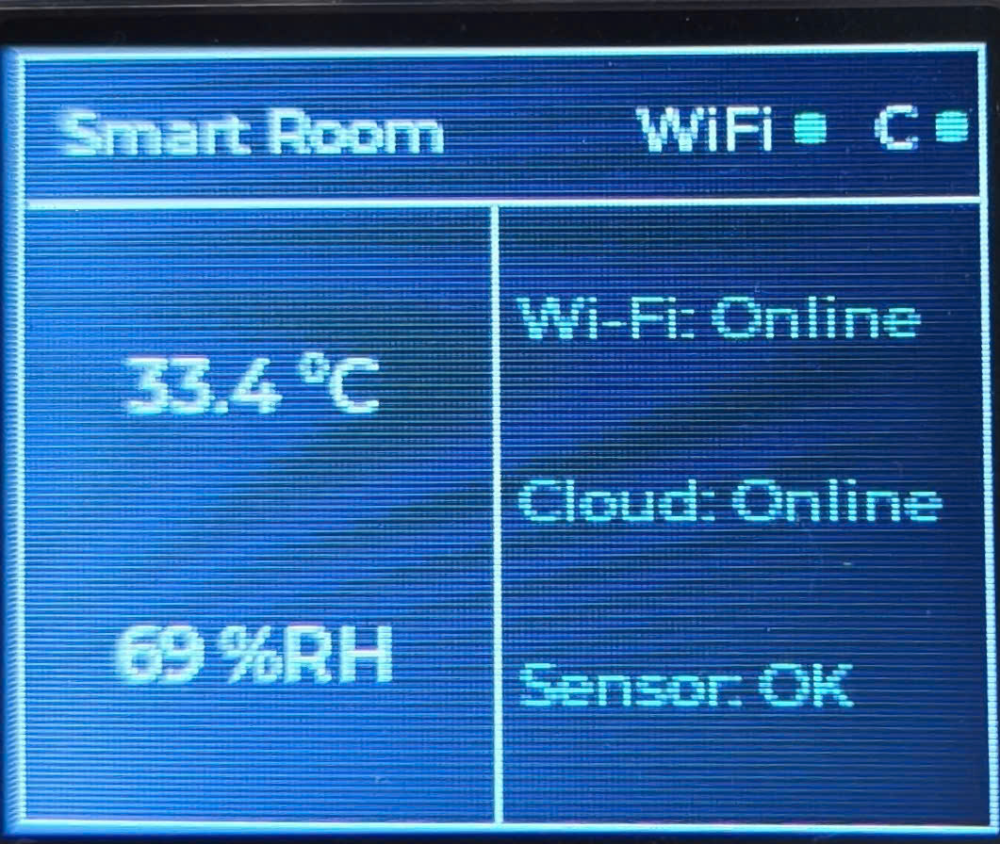
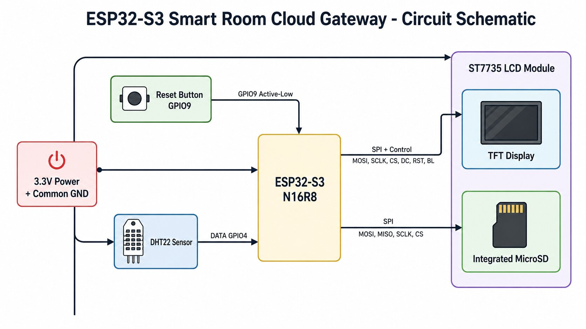
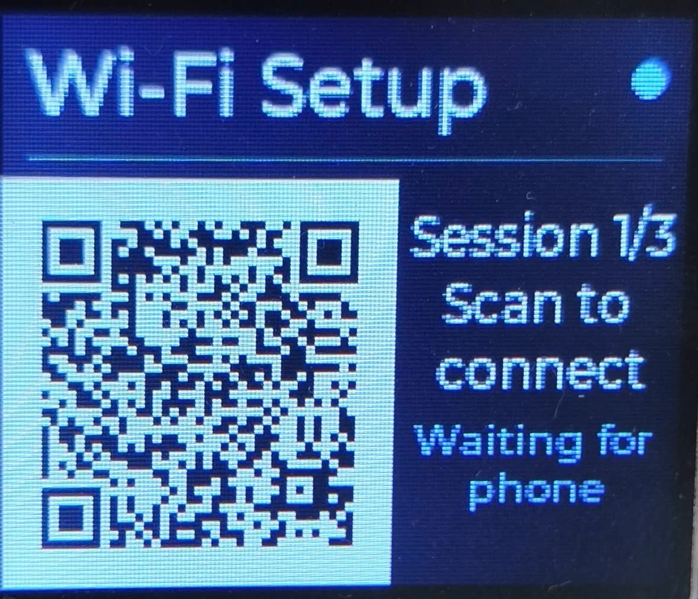
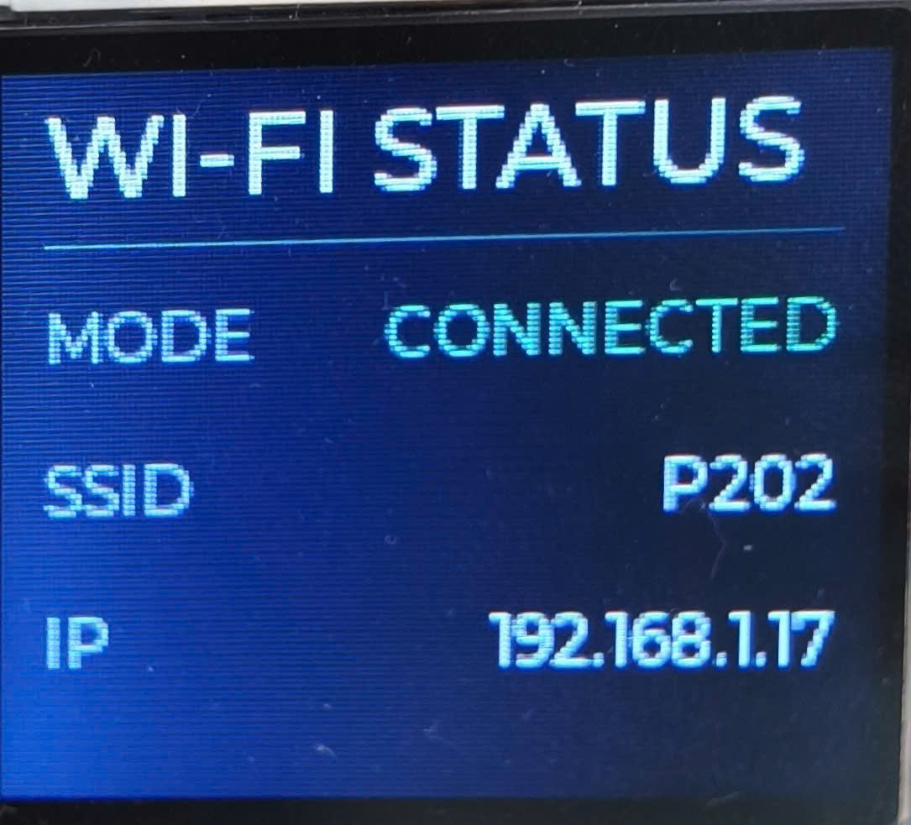
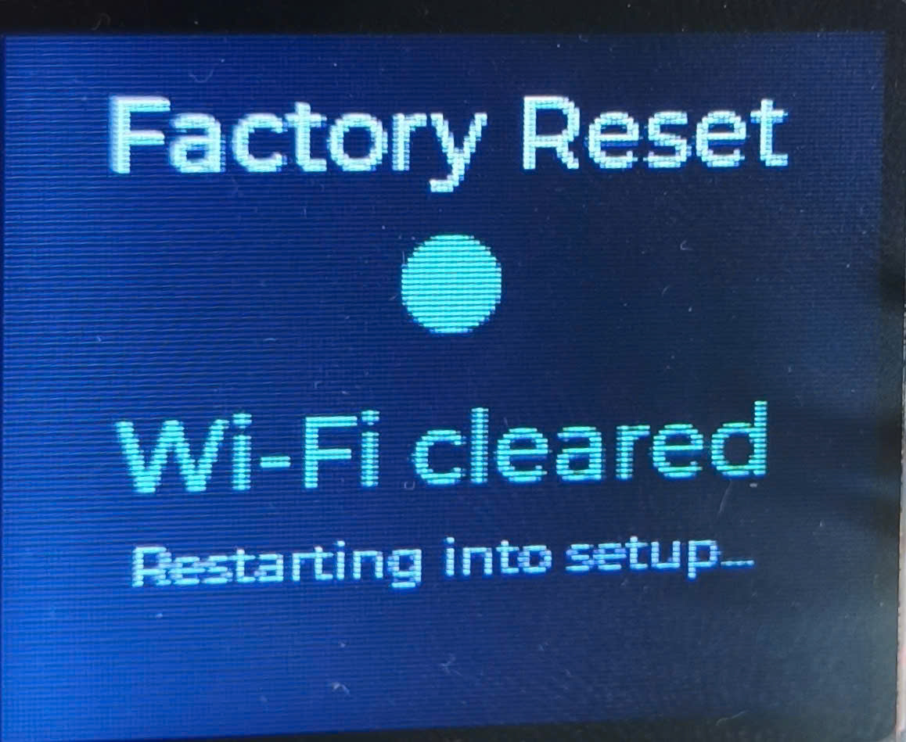
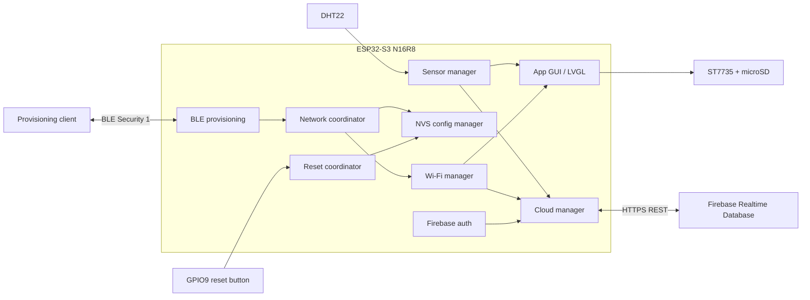

# ESP32-S3 Smart Room Cloud Gateway

An ESP-IDF smart-room gateway for the ESP32-S3 N16R8 with a local LVGL
dashboard, BLE Wi-Fi provisioning, DHT22 monitoring, authenticated Firebase
Realtime Database telemetry, persistent configuration, automatic recovery, and
runtime resource diagnostics.

```text
Release: v1.0.0
Status: Hardware accepted / Version 1 complete
Target: ESP32-S3 N16R8
Framework: ESP-IDF 6.0.1 + FreeRTOS
```

## Product Demo

[](https://youtube.com/shorts/9C5_hecEgXA?feature=share)

> Select the dashboard image to watch the target-hardware demo.

| Prototype | BLE provisioning |
|---|---|
|  |  |

| Wi-Fi status | Sensor dashboard | Factory reset result |
|---|---|---|
|  |  |  |

See the [media index](docs/media/README.md) for the evidence list and public
sanitization rules.

## Version 1 Capabilities

- ST7735 128x160 SPI display with LVGL 9.
- DHT22 temperature and humidity sampling with stale/error handling.
- BLE Security 1 Wi-Fi provisioning with an LCD QR code.
- NVS-backed configuration validation, persistence, migration, and reset.
- Wi-Fi Station reconnect with exponential backoff.
- Firebase Email/Password authentication and ID-token refresh.
- Authenticated latest-value telemetry upload over HTTPS REST.
- Bounded cloud retry with network-edge and token-generation invalidation.
- GPIO9 five-second factory reset and reboot-to-provisioning recovery.
- CPU, Internal RAM, PSRAM, DMA-capable heap, task, and stack diagnostics.
- Explicit PSRAM placement for selected task stacks and bulk buffers.

## System Overview



### Ownership Boundaries

| Component | Responsibility |
|---|---|
| `wifi_manager` | Wi-Fi Station lifecycle and reconnect |
| `provisioning_manager` | Temporary BLE provisioning transport |
| `config_manager` | Persistent application configuration |
| `sensor_manager` | DHT22 sampling and sensor state |
| `firebase_auth` | Sign-in, token cache, refresh, UID validation |
| `cloud_manager` | Latest-value telemetry and retry policy |
| `app_gui` / `ui_manager_lvgl` | Screens, copied UI models, LVGL ownership |
| `button_manager` | Debounced input event publication |
| `app_reset_coordinator` | Ordered factory-reset transaction |

Callbacks copy data and return quickly. Network, sensor, button, provisioning,
and cloud callbacks never call LVGL directly.

## Hardware

| Device | Purpose |
|---|---|
| ESP32-S3 N16R8 | Main controller, 16 MB flash, 8 MiB Octal PSRAM |
| ST7735 128x160 TFT | LVGL dashboard and provisioning QR |
| Integrated microSD slot/card | FAT filesystem and LVGL assets |
| DHT22 | Temperature and humidity |
| Active-low push button | Five-second factory reset |

### GPIO Map

| Function | GPIO |
|---|---:|
| LCD MOSI | 11 |
| LCD SCLK | 12 |
| LCD CS | 10 |
| LCD DC | 13 |
| LCD RST | 14 |
| LCD backlight | 15 |
| SD MOSI | 16 |
| SD MISO | 17 |
| SD SCLK | 18 |
| SD CS | 8 |
| DHT22 data | 4 |
| Factory-reset button | 9 |

Always confirm the source of truth in
[`board_config.h`](components/system/common/include/board_config.h) before
rewiring hardware.

## Runtime Flow

```text
first boot / no valid Wi-Fi configuration
    -> display BLE provisioning QR
    -> receive credentials securely over BLE
    -> verify Wi-Fi and IPv4
    -> persist and read back configuration
    -> stop BLE and adopt the Station connection
    -> show dashboard
    -> authenticate and upload telemetry
```

Recovery behavior:

```text
Wi-Fi or Internet unavailable
    -> Wi-Fi reconnect or Cloud Wait/Retry
    -> network restored
    -> stale HTTP/TLS client discarded
    -> newest telemetry uploaded
    -> Cloud Online
```

Factory reset:

```text
hold GPIO9 for five seconds
    -> quiesce network/provisioning work
    -> clear driver and application Wi-Fi persistence
    -> verify NOT_CONFIGURED
    -> present reset result
    -> reboot into BLE provisioning
```

## Quick Start

### Requirements

- ESP-IDF 6.0.1.
- ESP32-S3 N16R8 and the hardware listed above.
- FAT-formatted microSD card inserted before boot.
- Firebase project with Email/Password Authentication and Realtime Database.
- Espressif-compatible BLE Security 1 provisioning client.

### Configure And Build

```bash
git clone https://github.com/HaiHeHuoc/Smart_Room_Cloud_Gateway.git
cd Smart_Room_Cloud_Gateway
idf.py set-target esp32s3
idf.py menuconfig
idf.py build
idf.py -p <PORT> flash monitor
```

Configure Firebase under:

```text
Smart Room Cloud Gateway
└── Firebase development configuration
```

Complete guides:

- [Hardware, build, flash, and first-boot setup](docs/SETUP.md)
- [Firebase Authentication and Security setup](components/cloud/firebase_auth/docs/FIREBASE_SETUP_AND_SECURITY.md)

## Firebase Security Model

Version 1 uses a dedicated Email/Password device account. `firebase_auth`
obtains and refreshes an ID token; `cloud_manager` authenticates Realtime
Database REST requests with that token. Database authorization must be enforced
with restrictive rules based on `auth.uid`.

Development values are entered through local `menuconfig` and generated into
`sdkconfig`, which is ignored by Git. They are still compiled into the firmware
image. This is appropriate for the documented portfolio/development release,
not a production secret-storage architecture.

Never commit or publish:

- Firebase passwords, ID tokens, or refresh tokens;
- service-account JSON files or private keys;
- Wi-Fi credentials or provisioning secrets;
- `sdkconfig` containing real local values;
- firmware binaries built with real credentials.

See [SECURITY.md](SECURITY.md) for the repository security policy and public
release checklist.

## Runtime Snapshot

Representative accepted report after PSRAM optimization:

| Metric | Observation |
|---|---:|
| CPU used | 3.2% |
| Internal RAM free | 203,951 B |
| Internal RAM minimum | 160,427 B |
| Largest Internal block | 88,064 B |
| PSRAM free | 8,163,340 B |
| DMA-capable RAM free | 196,163 B |
| Tasks | 17 |

These are workload snapshots, not fixed guarantees. Internal and DMA-capable
heap capabilities overlap and must not be added.

## Repository Layout

```text
main/                     application composition and project Kconfig
components/application/  network and reset coordinators
components/cloud/        Firebase authentication and telemetry
components/connectivity/ Wi-Fi and BLE provisioning
components/display/      ST7735 integration
components/input/        button handling
components/sensing/      DHT22 and sensor manager
components/storage/      NVS configuration and SD card
components/system/       shared configuration and diagnostics
components/ui/           LVGL runtime, screens, filesystem, and images
docs/                    architecture, setup, demo, limitations, and media
Test/                    host and component test utilities
```

## Documentation

- [Version 1 release record](VERSION_1_RELEASE.md)
- [Architecture](docs/ARCHITECTURE.md)
- [Setup and build](docs/SETUP.md)
- [Firebase setup and security](components/cloud/firebase_auth/docs/FIREBASE_SETUP_AND_SECURITY.md)
- [Hardware demo](docs/DEMO.md)
- [Media index](docs/media/README.md)
- [Known limitations and future work](docs/KNOWN_LIMITATIONS.md)
- [Historical implementation roadmap](ESP32S3_Smart_Room_Cloud_Gateway_Roadmap.md)
- [Version 2 Xiaozhi roadmap](XIAOZHI_IMPLEMENTATION_ROADMAP.md)

## Known Product Boundaries

- Telemetry keeps only the newest pending value; there is no offline history.
- Device credentials are compiled into development firmware.
- No secure-boot, flash-encryption, OTA, or hardware-backed identity policy is
  included in Version 1.
- Provisioning uses a development Proof of Possession rather than a
  manufacturing-time per-device secret.
- SD card removal and runtime service deinitialization are not implemented.

See [Known limitations and future work](docs/KNOWN_LIMITATIONS.md) for details.

## Version 2 Direction

Version 2 begins with audio hardware validation, followed by a project-owned
`audio_manager`, an isolated `voice_assistant` adapter, and staged
`esp_xiaozhi` integration. It must preserve all Version 1 ownership boundaries.

## License

No explicit open-source license is currently included. Until the owner selects
one, the repository is source-available portfolio code under default copyright
rather than an open-source distribution.
