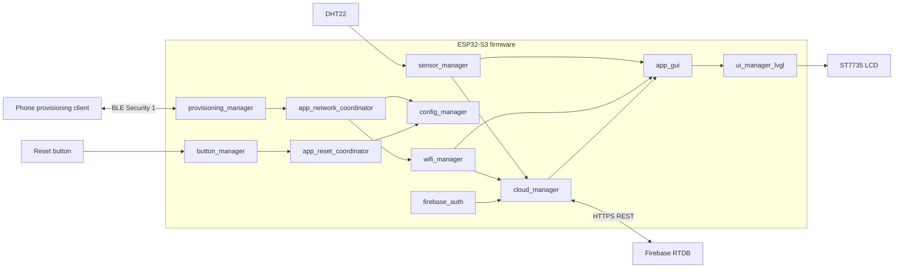

# ESP32-S3 Smart Room Cloud Gateway

A practical ESP-IDF portfolio project that turns an ESP32-S3 into a smart-room gateway with BLE Wi-Fi provisioning, an LVGL dashboard, DHT22 monitoring, Firebase Realtime Database telemetry, NVS configuration, factory-reset recovery, and runtime performance diagnostics.

## Highlights

- ESP32-S3 N16R8: 16 MB flash and 8 MiB Octal PSRAM.
- ESP-IDF 6.0.1 and FreeRTOS.
- ST7735 128x160 SPI LCD with LVGL 9.
- BLE Security 1 Wi-Fi provisioning with an on-screen QR code.
- DHT22 temperature and humidity monitoring.
- Authenticated Firebase latest-value upload over HTTPS REST.
- NVS configuration validation, migration, persistence, and reset.
- Event-driven Wi-Fi reconnect and bounded cloud retry.
- Queue-driven GUI with one LVGL owner task.
- CPU, heap, fragmentation, task, and stack diagnostics.
- Explicit PSRAM placement for selected stacks and bulk buffers.

## Status

| Area | Status |
|---|---|
| LCD and LVGL | Done |
| Wi-Fi Station | Done |
| Sensor monitoring | Done |
| Firebase telemetry | Done |
| NVS configuration | Done |
| BLE provisioning | Implemented; final full regression remains tracked |
| Factory reset | Implemented; final race/UI regression remains tracked |
| Reconnect and cloud retry | Done; user hardware accepted on 2026-08-02 |
| Portfolio documentation | Implemented; real photos and demo video still pending |
| Voice/Xiaozhi extension | Optional future roadmap |

See [the full roadmap](ESP32S3_Smart_Room_Cloud_Gateway_Roadmap.md).

## Hardware

| Device | Purpose |
|---|---|
| ESP32-S3 N16R8 | Main controller |
| ST7735 128x160 TFT | LVGL dashboard and provisioning QR |
| DHT22 | Temperature and humidity |
| MicroSD card | FAT filesystem and LVGL assets |
| Active-low button | Five-second factory reset |

### Pin Map

| Function | GPIO |
|---|---:|
| LCD MOSI | 11 |
| LCD SCLK | 12 |
| LCD CS | 10 |
| LCD DC | 13 |
| LCD RST | 14 |
| LCD backlight | 15 |
| SD MOSI | 16 |
| SD MISO | 17 |
| SD SCLK | 18 |
| SD CS | 8 |
| DHT22 data | 4 |
| Factory-reset button | 9 |

Confirm wiring against [`board_config.h`](components/system/common/include/board_config.h).

## Architecture



### Ownership Rules

- `wifi_manager` owns Station connection and reconnect.
- `provisioning_manager` owns temporary BLE provisioning.
- `config_manager` owns persistent application configuration.
- `cloud_manager` owns telemetry upload and retry.
- `firebase_auth` owns token lifecycle.
- `app_gui` owns application screens, queues, and LVGL objects.
- `ui_manager_lvgl` owns LVGL initialization, display integration, tick, and mutex.
- `button_manager` publishes input events only.
- `app_reset_coordinator` owns the ordered reset transaction.

No network, sensor, button, provisioning, or cloud callback calls LVGL directly.

Read [the architecture guide](docs/ARCHITECTURE.md) for task, queue, state-machine, and memory details.

## Main Flow

```text
first boot or no valid Wi-Fi config
    -> BLE provisioning screen and QR
    -> verified Wi-Fi and IPv4
    -> save/read-back through NVS
    -> stop BLE and adopt Station connection
    -> Wi-Fi status
    -> sensor dashboard
    -> authenticated Firebase upload
```

During runtime:

```text
Wi-Fi lost
    -> reconnect backoff
    -> Cloud Wait/Retry
    -> Wi-Fi and IPv4 restored
    -> cloud task wakes
    -> newest telemetry uploads
    -> Cloud Online
```

## Repository Layout

```text
main/                    application composition and Kconfig
components/application/ network and reset coordinators
components/cloud/       Firebase authentication and telemetry
components/connectivity/Wi-Fi and BLE provisioning
components/display/     ST7735 integration
components/input/       button handling
components/sensing/     DHT22 and sensor manager
components/storage/     NVS config and SD card
components/system/      common config and diagnostics
components/ui/          LVGL runtime, screens, files, and images
docs/                   architecture, setup, demo, and limitations
```

## Quick Start

### Requirements

- ESP-IDF 6.0.1.
- Correctly wired target hardware.
- FAT-formatted microSD card inserted during startup.
- Firebase project with Email/Password authentication and Realtime Database.
- BLE provisioning client compatible with Espressif Security 1.

### Configure

```bash
idf.py set-target esp32s3
idf.py menuconfig
```

Open:

```text
Smart Room Cloud Gateway
└── Firebase development configuration
```

Set the Firebase Web API key, dedicated device account, and optional expected UID. The values are stored in the local generated `sdkconfig`, which is ignored by Git.

### Build And Flash

```bash
idf.py build
idf.py -p <PORT> flash monitor
```

Full instructions: [Setup and build guide](docs/SETUP.md).

## User Flows

### Provisioning

1. Boot without valid application Wi-Fi configuration.
2. Scan the LCD QR code with a compatible provisioning client.
3. Send Wi-Fi credentials over BLE.
4. Wait for Wi-Fi and IPv4 verification.
5. The application persists and reads back the configuration.
6. BLE resources are cleaned up and Wi-Fi ownership transfers to `wifi_manager`.

### Sensor And Cloud

- DHT22 samples approximately every two seconds.
- Sensor data is copied to the GUI and cloud paths.
- The cloud queue retains the newest pending value.
- Firebase upload uses authenticated HTTPS.

### Factory Reset

Hold the reset button for five seconds. The reset coordinator quiesces network activity, clears verified Wi-Fi persistence, presents the reset result through the UI task, and restarts into provisioning.

## Runtime Snapshot

Representative user-measured report after PSRAM optimization:

| Metric | Value |
|---|---:|
| CPU used | 3.2% |
| Internal RAM free | 203,951 B |
| Internal RAM minimum | 160,427 B |
| Largest internal block | 88,064 B |
| PSRAM free | 8,163,340 B |
| DMA-capable RAM free | 196,163 B |
| Tasks | 17 |

Selected task stacks:

| Task | Location | Minimum remaining |
|---|---|---:|
| `app_gui_ui` | PSRAM | 20,880 B |
| `cloud_manager` | PSRAM | 8,052 B |
| `sensor_manager` | PSRAM | 2,240 B |
| `button_manager` | PSRAM | 2,360 B |
| `perf_monitor` | Internal | 4,536 B |

These are workload snapshots, not fixed guarantees. Internal and DMA-capable heap totals overlap and must not be added.

## Demo

The planned portfolio sequence is:

```text
hardware overview
-> BLE QR provisioning
-> Wi-Fi status
-> sensor dashboard
-> Firebase update
-> hotspot off/on recovery
-> long-press factory reset
-> provisioning returns
```

Use the [demo guide](docs/DEMO.md) and [media checklist](docs/media/README.md). Real hardware photos and video are still required; this update does not fabricate them.

## Known Limitations

- Development Firebase values are compiled into firmware.
- Any credential that previously entered Git history must be rotated.
- Telemetry is latest-value only; there is no offline historical queue.
- SD card removal is not detected and no public unmount API exists.
- Provisioning currently uses a development Proof of Possession.
- No OTA, MQTT, custom mobile app, or local web dashboard is included.
- Final provisioning/reset cross-phase regressions remain tracked in the roadmap.

See [Known limitations and future work](docs/KNOWN_LIMITATIONS.md).

## Security

- Never commit Wi-Fi credentials, account credentials, tokens, provisioning secrets, or private keys.
- Configure development Firebase values locally through menuconfig.
- Use a restricted device account and restricted database rules.
- Rotate any value that has ever been committed, even after it is removed from the current source.
- Treat provisioning QR payloads, serial logs, and firmware binaries as sensitive development artifacts.

## Documentation

- [Architecture](docs/ARCHITECTURE.md)
- [Setup and build](docs/SETUP.md)
- [Demo guide](docs/DEMO.md)
- [Known limitations and future work](docs/KNOWN_LIMITATIONS.md)
- [Roadmap and sprint tracking](ESP32S3_Smart_Room_Cloud_Gateway_Roadmap.md)
- [Optional Xiaozhi extension roadmap](XIAOZHI_IMPLEMENTATION_ROADMAP.md)

## Interview Talking Points

The project demonstrates ESP-IDF component boundaries, FreeRTOS queues and tasks, safe LVGL ownership, BLE-to-Wi-Fi provisioning, NVS recovery, authenticated HTTPS telemetry, reconnect/backoff design, lifecycle debugging, and measured Internal RAM/PSRAM/DMA behavior.

## License

No explicit open-source license is currently included. Until the owner selects one, treat the repository as source-available portfolio code rather than reusable open-source software.
