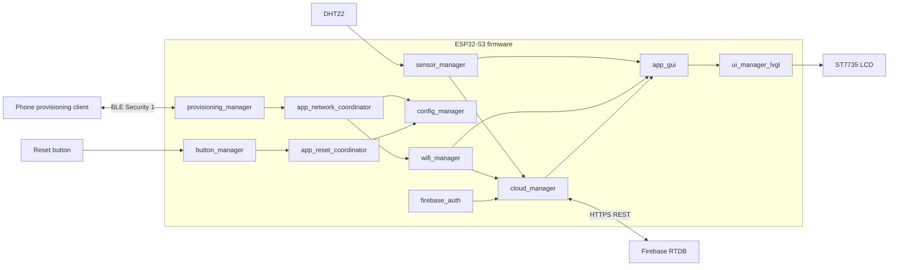

# ESP32-S3 Smart Room Cloud Gateway

A practical ESP-IDF project that turns an ESP32-S3 into a smart-room gateway with BLE Wi-Fi provisioning, an LVGL dashboard, DHT22 monitoring, Firebase Realtime Database telemetry, NVS configuration, factory-reset recovery, network retry, and runtime diagnostics.

## Version 1 Status

```text
Release: v1.0.0
Status: COMPLETE
Closed: 2026-08-02
```

Version 1 covers Sprints 0–9. The project owner has confirmed all remaining test and target-hardware acceptance items as complete.

- [Version 1 release record](VERSION_1_RELEASE.md)
- [Sprint 9 portfolio closure](PHASE_9_PORTFOLIO_STATUS.md)
- [Historical roadmap and implementation tracking](ESP32S3_Smart_Room_Cloud_Gateway_Roadmap.md)

The roadmap preserves detailed implementation history and may contain older pending checkboxes. `VERSION_1_RELEASE.md` is the authoritative Version 1 closure status.

## Highlights

- ESP32-S3 N16R8 with 16 MB flash and 8 MiB Octal PSRAM.
- ESP-IDF 6.0.1 and FreeRTOS.
- ST7735 128x160 SPI LCD with LVGL 9.
- BLE Security 1 Wi-Fi provisioning with an LCD QR code.
- Wi-Fi Station connection with exponential-backoff reconnect.
- DHT22 temperature and humidity monitoring.
- Authenticated Firebase Realtime Database telemetry over HTTPS REST.
- NVS schema validation, migration, persistence, and factory reset.
- Queue-driven GUI with a single LVGL owner task.
- Latest-value cloud queue with bounded retry and network-edge wake-up.
- CPU, heap, fragmentation, task, and stack diagnostics.
- Explicit PSRAM placement for selected task stacks and bulk allocations.

## Version 1 Feature Status

| Area | Status |
|---|---|
| Project structure and ESP-IDF workflow | Done |
| LCD and LVGL | Done |
| Wi-Fi Station and reconnect | Done |
| Sensor monitoring | Done |
| Firebase authentication and telemetry | Done |
| NVS configuration storage | Done |
| BLE Wi-Fi provisioning | Done |
| Factory reset and recovery | Done |
| Cloud retry and recovery | Done |
| Portfolio documentation | Done |
| Voice/Xiaozhi extension | Version 2 roadmap |

## Hardware

| Device | Purpose |
|---|---|
| ESP32-S3 N16R8 | Main controller |
| ST7735 128x160 TFT | LVGL dashboard and provisioning QR |
| DHT22 | Temperature and humidity |
| MicroSD card | FAT filesystem and LVGL assets |
| Active-low push button | Five-second factory reset |

### Pin Map

| Function | GPIO |
|---|---:|
| LCD MOSI | 11 |
| LCD SCLK | 12 |
| LCD CS | 10 |
| LCD DC | 13 |
| LCD RST | 14 |
| LCD backlight | 15 |
| SD MOSI | 16 |
| SD MISO | 17 |
| SD SCLK | 18 |
| SD CS | 8 |
| DHT22 data | 4 |
| Factory-reset button | 9 |

Confirm wiring against [`board_config.h`](components/system/common/include/board_config.h).

## Architecture



### Ownership Rules

- `wifi_manager` owns Wi-Fi Station lifecycle and reconnect.
- `provisioning_manager` owns temporary BLE provisioning.
- `config_manager` owns persistent application configuration.
- `cloud_manager` owns telemetry upload and retry.
- `firebase_auth` owns token lifecycle.
- `app_gui` owns application screens, copied models, queues, and LVGL objects.
- `ui_manager_lvgl` owns LVGL initialization, display integration, tick, and synchronization.
- `button_manager` publishes input events only.
- `app_reset_coordinator` owns the ordered factory-reset transaction.

No network, sensor, button, provisioning, or cloud callback calls LVGL directly.

Read [the architecture guide](docs/ARCHITECTURE.md) for the detailed task, queue, state-machine, and memory model.

## Main Runtime Flow

```text
first boot or no valid Wi-Fi configuration
    -> BLE provisioning screen and QR
    -> verified Wi-Fi and IPv4
    -> save and read back configuration through NVS
    -> stop BLE and adopt the Station connection
    -> Wi-Fi status screen
    -> sensor dashboard
    -> authenticated Firebase upload
```

Runtime recovery:

```text
Wi-Fi or Internet unavailable
    -> Wi-Fi reconnect or Cloud Wait/Retry
    -> network restored
    -> cloud task wakes
    -> newest telemetry uploads
    -> Cloud Online
```

Factory reset:

```text
five-second button hold
    -> quiesce network/provisioning work
    -> clear application and driver Wi-Fi persistence
    -> verify NOT_CONFIGURED
    -> display reset result
    -> reboot
    -> provisioning screen returns
```

## Repository Layout

```text
main/                     application composition and project Kconfig
components/application/  network and reset coordinators
components/cloud/        Firebase authentication and telemetry
components/connectivity/ Wi-Fi and BLE provisioning
components/display/      ST7735 integration
components/input/        button handling
components/sensing/      DHT22 and sensor manager
components/storage/      NVS configuration and SD card
components/system/       shared configuration and diagnostics
components/ui/           LVGL runtime, screens, filesystem, and images
docs/                    architecture, setup, demo, limitations, and media
```

## Quick Start

### Requirements

- ESP-IDF 6.0.1.
- Correctly wired ESP32-S3 target hardware.
- FAT-formatted microSD card inserted during startup.
- Firebase project with Email/Password authentication and Realtime Database.
- BLE provisioning client compatible with Espressif Security 1.

### Configure

```bash
idf.py set-target esp32s3
idf.py menuconfig
```

Open:

```text
Smart Room Cloud Gateway
└── Firebase development configuration
```

Set the Firebase Web API key, dedicated development device account, password, and optional expected UID. These values are stored in the local generated `sdkconfig`, which is ignored by Git.

### Build And Flash

```bash
idf.py build
idf.py -p <PORT> flash monitor
```

Full instructions: [Setup and build guide](docs/SETUP.md).

## Runtime Snapshot

Representative user-measured report after PSRAM optimization:

| Metric | Value |
|---|---:|
| CPU used | 3.2% |
| Internal RAM free | 203,951 B |
| Internal RAM minimum | 160,427 B |
| Largest internal block | 88,064 B |
| PSRAM free | 8,163,340 B |
| DMA-capable RAM free | 196,163 B |
| Tasks | 17 |

Selected task stacks:

| Task | Location | Minimum remaining |
|---|---|---:|
| `app_gui_ui` | PSRAM | 20,880 B |
| `cloud_manager` | PSRAM | 8,052 B |
| `sensor_manager` | PSRAM | 2,240 B |
| `button_manager` | PSRAM | 2,360 B |
| `perf_monitor` | Internal | 4,536 B |

These values are representative workload snapshots, not fixed guarantees. Internal and DMA-capable heap totals overlap and must not be added.

## Version 1 Demo

The recommended portfolio sequence is:

```text
hardware overview
-> BLE QR provisioning
-> Wi-Fi status
-> sensor dashboard
-> Firebase update
-> hotspot off/on recovery
-> long-press factory reset
-> provisioning returns
```

HaiHeHuoc888: update here + add the real Version 1 hardware gallery using files under `docs/media/`.

HaiHeHuoc888: update here + add the final Version 1 demo video link.

See:

- [Demo guide](docs/DEMO.md)
- [Version 1 media placeholders](docs/media/V1_MEDIA_PLACEHOLDERS.md)
- [Media capture and sanitization guide](docs/media/README.md)

## Known Limitations

- Development Firebase values are compiled into development firmware.
- Credentials that previously appeared in Git history must be rotated before public publication.
- Telemetry is latest-value only; there is no offline historical queue.
- SD card removal is not detected and no public unmount API exists.
- Provisioning currently uses a development Proof of Possession.
- No OTA, MQTT, custom mobile app, or local web dashboard is included in Version 1.

See [Known limitations and future work](docs/KNOWN_LIMITATIONS.md).

## Security

- Never commit Wi-Fi credentials, Firebase account credentials, tokens, provisioning secrets, or private keys.
- Configure development Firebase values locally through menuconfig.
- Use a restricted device account and restricted database rules.
- Rotate any credential that has ever been committed, even after removal from the current source.
- Treat provisioning QR payloads, serial logs, screenshots, videos, and firmware binaries as potentially sensitive development artifacts.

## Documentation

- [Version 1 release record](VERSION_1_RELEASE.md)
- [Sprint 9 portfolio closure](PHASE_9_PORTFOLIO_STATUS.md)
- [Architecture](docs/ARCHITECTURE.md)
- [Setup and build](docs/SETUP.md)
- [Demo guide](docs/DEMO.md)
- [Known limitations and future work](docs/KNOWN_LIMITATIONS.md)
- [Version 1 media placeholders](docs/media/V1_MEDIA_PLACEHOLDERS.md)
- [Historical roadmap](ESP32S3_Smart_Room_Cloud_Gateway_Roadmap.md)
- [Optional Xiaozhi extension roadmap](XIAOZHI_IMPLEMENTATION_ROADMAP.md)

## Interview Talking Points

The project demonstrates ESP-IDF component boundaries, FreeRTOS tasks and queues, safe LVGL ownership, BLE-to-Wi-Fi provisioning, NVS recovery, authenticated HTTPS telemetry, reconnect/backoff design, lifecycle and race-condition handling, and measured Internal RAM/PSRAM/DMA behavior.

## Version 2 Direction

Version 1 is closed. Version 2 begins with audio hardware validation and must preserve Version 1 component ownership before integrating `esp_xiaozhi` through project-owned `audio_manager` and `voice_assistant` layers.

## License

No explicit open-source license is currently included. Until the owner selects one, treat the repository as source-available portfolio code rather than reusable open-source software.
