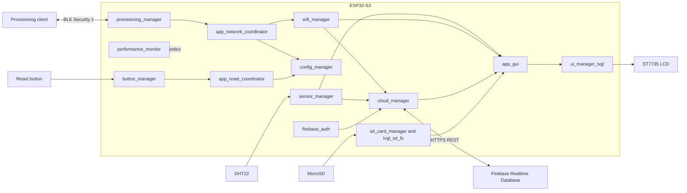
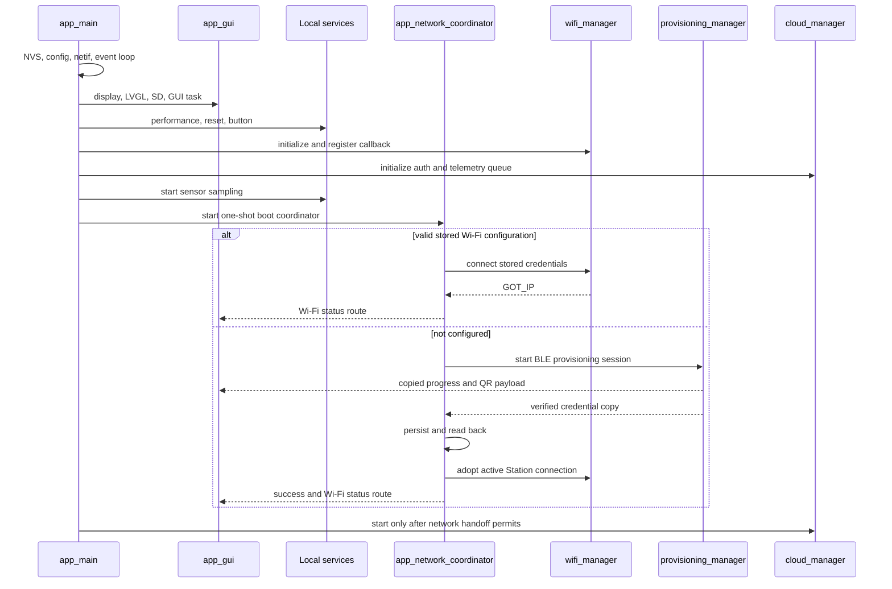
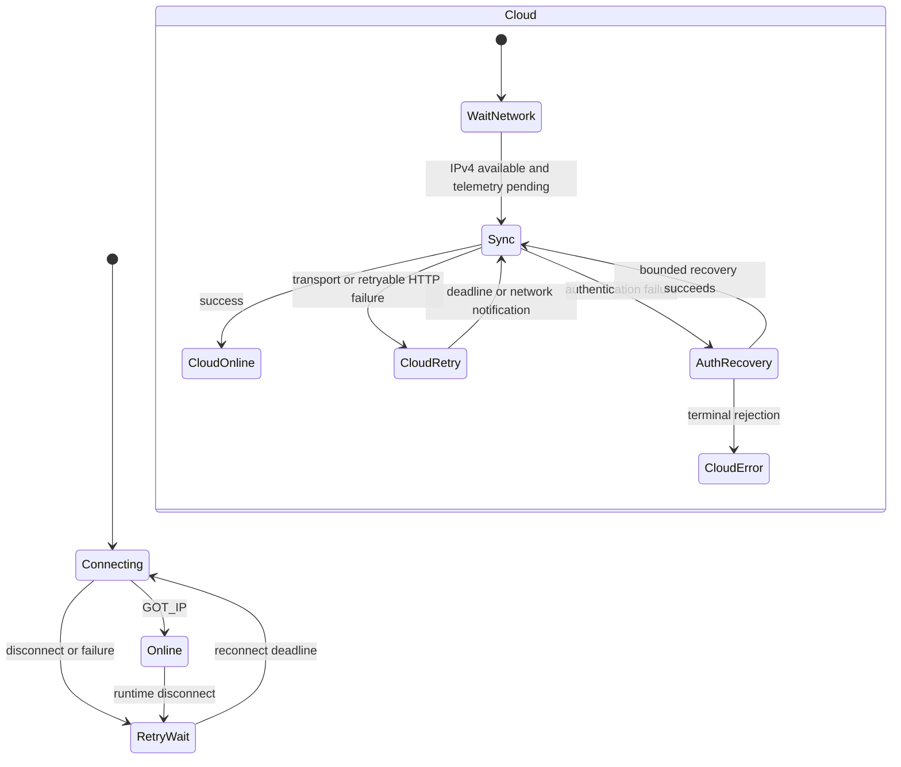

# Architecture

## Goal

Document the production ownership, task, queue, callback, storage, and recovery design of the ESP32-S3 Smart Room Cloud Gateway.

## System Context



## Component Ownership

| Component | Owns | Does not own |
|---|---|---|
| `wifi_manager` | Station lifecycle, driver serialization, reconnect | Provisioning policy, NVS schema, GUI |
| `provisioning_manager` | Temporary BLE provisioning lifecycle and verified credential handoff | Persistent storage, reconnect, GUI |
| `config_manager` | NVS schema, validation, migration, read/write/erase | Wi-Fi driver or provisioning transport |
| `app_network_coordinator` | Boot policy, provisioning sessions, persistence/adoption ordering | Driver internals, LVGL rendering |
| `sensor_manager` | Periodic DHT22 sampling, validation, stale/error state | GUI and cloud ownership |
| `firebase_auth` | Sign-in, token cache, refresh, invalidation | Telemetry scheduling |
| `cloud_manager` | Latest-value telemetry, HTTP client, retry/backoff | Wi-Fi connect/disconnect |
| `app_gui` | Screens, copied models, queues, UI task, LVGL objects | Network and storage policy |
| `ui_manager_lvgl` | LVGL initialization, tick, display binding, mutex | Application screen policy |
| `button_manager` | Polling, debounce, press/release/long-press events | Erase, reboot, LVGL |
| `app_reset_coordinator` | Ordered reset transaction and verified reboot | Button electrical handling |
| `performance_monitor` | CPU, heap, task, and stack diagnostics | Runtime policy decisions |

## Boot Sequence



## Runtime Event Flow

```text
DHT22
  -> sensor_manager task
  -> copied sensor callback
      -> app_gui sensor queue
      -> cloud_manager latest-value queue

Wi-Fi event loop
  -> wifi_manager state machine
  -> copied status callback
      -> app_network_coordinator runtime state
      -> app_gui Wi-Fi queue
      -> cloud_manager network epoch/notification

cloud_manager task
  -> firebase_auth
  -> esp_http_client
  -> copied cloud status callback
  -> app_gui cloud queue
```

Callbacks copy bounded data and return promptly. They do not call LVGL, perform NVS erase, start provisioning, reboot, or execute long network operations.

## GUI Threading Contract

Only the `app_gui` UI task creates, updates, loads, and deletes LVGL objects.

```text
producer task/callback
    -> copy status or command into a bounded queue
    -> return

app_gui UI task
    -> drain commands and latest-value models
    -> take LVGL mutex
    -> build/render/switch screens
    -> call lv_timer_handler()
    -> release LVGL mutex
```

Current application screens:

- Boot
- BLE provisioning with QR code
- Wi-Fi status
- Sensor dashboard with cloud summary
- Factory-reset result

## Wi-Fi And Cloud Recovery



`wifi_manager` owns reconnect. `cloud_manager` consumes connectivity facts and never calls Wi-Fi connect/disconnect. The cloud task uses a non-zero network epoch to discard stale HTTP client state after network changes.

Telemetry is latest-value only. During an outage, newer sensor data replaces older pending data instead of growing an unbounded history queue.

## Factory Reset Flow

```text
button_manager long press
    -> non-blocking copied event
    -> app_reset_coordinator
    -> app_network_coordinator reset gate and quiescence
    -> wifi_manager persistent driver cleanup
    -> config_manager application Wi-Fi erase and verification
    -> app_gui reset-result presentation
    -> esp_restart()
    -> boot into provisioning
```

Persistent cleanup failure suppresses reboot. GUI presentation failure cannot suppress a reboot after storage cleanup has already been verified.

## Memory Strategy

- DMA buffers and descriptors remain in DMA-capable internal RAM.
- Critical control state, driver state, locks, and system tasks remain internal.
- Selected bulk buffers, GUI/cloud task stacks, sensor stack, and button stack use PSRAM.
- `performance_monitor` task stack intentionally remains internal.
- Large project-owned allocations use explicit heap capabilities instead of a project-wide task-stack policy.

Representative measured state:

| Metric | Value |
|---|---:|
| Internal free | 203,951 B |
| Internal minimum | 160,427 B |
| Largest internal block | 88,064 B |
| PSRAM free | 8,163,340 B |
| DMA-capable free | 196,163 B |
| CPU used | 3.2% |

These numbers are snapshots and must be compared under equivalent workload and lifecycle conditions.

## Design Principles

1. One clear owner for every driver, state machine, queue, and persistent record.
2. No LVGL calls outside the UI task.
3. No blocking or logging while holding short critical sections.
4. Finite timeouts for cross-component waits.
5. Deep-copy callback data with documented lifetime.
6. Latest-value queues when historical delivery is not required.
7. Securely clear transient credentials and provisioning payloads.
8. Measure memory and stack behavior before optimizing.
